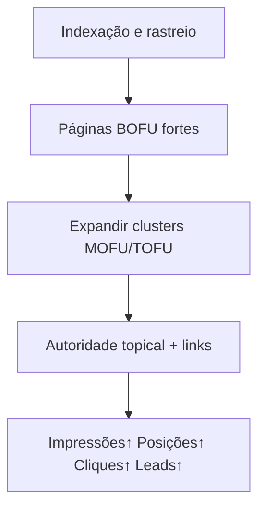
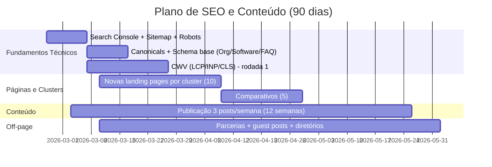

# Auditoria SEO e Plano de Crescimento Orgânico do

## Resumo executivo

O site atual está bem posicionado para **capturar buscas de alta intenção** porque já apresenta, de forma explícita, o “trinômio” que mais aparece em SERPs competitivas do nicho: **agendamento via WhatsApp + painel/gestão + automação** (ex.: H1 “Agendamento de barbearia pelo WhatsApp”, “sistema para barbearia…”, “painel para barbeiro”). citeturn22view0turn7view0turn7view1turn7view2

Ao mesmo tempo, o site está **subdimensionado para crescer organicamente** porque parece operar quase exclusivamente com páginas de fundo de funil (produto/planos/FAQ) e pouco conteúdo para capturar intenção informacional e comparativa (topo/meio de funil). O menu e a estrutura visível priorizam seções e páginas de “produto”, sem evidência de blog/centro de conteúdo próprio no domínio auditado. citeturn22view0turn7view0turn7view1turn7view2

O risco mais crítico, antes de qualquer “hack” de palavra‑chave, é básico: **se o site não estiver plenamente rastreável e indexável, nada cresce**. A própria documentação do entity["company","Google","search engine company"] reforça que tarefas como sitemap, robots e controle de indexação precisam ser tratadas com rigor (ex.: robots.txt não é mecanismo para “sumir do Google”; sitemaps ajudam descoberta e priorização). citeturn3search0turn26search0turn3search9

Direção recomendada (sem enrolação): **(1)** blindar indexabilidade + arquitetura técnica (Search Console, sitemap, canonicais, schema, CWV), **(2)** criar um “mapa de intenção” e expandir páginas por cluster (features, casos de uso, comparativos, integrações), **(3)** construir autoridade topical com calendário editorial agressivo, **(4)** acoplar isso a um motor contínuo de link building/PR e parcerias. Diretrizes gerais: conteúdo útil e “people‑first”, e SEO como meio — não como fim. citeturn24search5turn24search0


citeturn24search0turn25search6turn26search9

## Diagnóstico técnico e de conteúdo

### O que existe hoje no domínio auditado

Há um conjunto enxuto de páginas estratégicas com foco em termos de alta intenção:

- Home com promessa direta e focada em keyword (“Agendamento de barbearia pelo WhatsApp”) e prova social (ex.: “5.000+ agendamentos”, “99,8% disponibilidade”). citeturn22view0  
- Página focada em “Agendamento WhatsApp para barbearia…”. citeturn7view0  
- Página focada em “Painel para barbeiro…”. citeturn7view1  
- Página focada em “Sistema para barbearia…”. citeturn7view2  
- Páginas legais (Termos e Privacidade) com atualização datada. citeturn7view3turn8view0  

Isso é bom para conversão (pouca dispersão), mas ruim para SEO escalável: você está tentando vencer SERPs com **poucas URLs** enquanto concorrentes constroem dezenas/centenas de páginas por intenção (inclusive informacionais). Esse padrão aparece claramente em players do nicho que mantêm blog/centro de conteúdo e múltiplas páginas por segmento. citeturn18view0turn18view1turn23search16

### Indexabilidade, rastreabilidade, sitemap e robots

Sem acesso ao seu Google Search Console e sem conseguir confirmar diretamente endpoints como `robots.txt` e `sitemap.xml` aqui, a auditoria precisa separar:

- **O que é verificável no conteúdo atual** (estrutura, headings, páginas existentes). citeturn22view0turn7view0turn7view1turn7view2  
- **O que deve ser validado via testes e relatórios padrão** (robots/sitemap/noindex/canonicals/coverage).  

Pontos‑chave (com base em fontes primárias):

- Um arquivo `robots.txt` **controla rastreio**, mas **não é mecanismo confiável para impedir indexação** (para isso, use `noindex` ou autenticação, conforme o caso). citeturn3search0  
- Sitemaps ajudam o Google a descobrir URLs importantes e você pode enviar via Search Console; há limites e boas práticas (ex.: páginas sugeridas como canônicas, índices de sitemap etc.). citeturn26search0turn26search14turn20search0  
- Se o domínio estiver novo ou com pouca autoridade, sitemap + links internos rastreáveis aceleram descoberta e cobertura. Também é crucial que links sejam rastreáveis e com âncoras claras. citeturn25search6  

### Canonicals, parâmetros e consolidação

Mesmo em sites pequenos, canonicais mal configurados destroem crescimento (duplicação e dispersão). O Google explica como escolhe URLs canônicos e como consolidar URLs duplicadas, inclusive usando `rel="canonical"` e sitemaps. citeturn20search0turn20search4turn20search8

Atenção especial se você tiver:

- Subdomínios por barbearia (ex.: aparece um exemplo `vitor-aleixo.cortezap.app.br` no site) — isso pode virar um “universo” de URLs duplicadas/finas se não houver estratégia clara (indexar minisites públicos vs bloquear dashboards). citeturn22view2  

### Mobile-first e Core Web Vitals

O Google prioriza indexação mobile-first e recomenda garantir equivalência e boas práticas para não perder indexação/visibilidade. citeturn20search2turn20search6turn20search14  

Core Web Vitals (LCP, INP, CLS) são métricas de experiência e o Google recomenda atingi-las para bons resultados e UX. citeturn5search5  

Sem dados de campo (CrUX/GSC) aqui, o caminho correto é medir:
- Lighthouse / PageSpeed Insights (laboratório) e CrUX/GSC (campo). O próprio Google documenta a leitura e uso (e a API `runpagespeed` para automatizar). citeturn6search22turn6search11turn5search5  

### Meta tags, headings e snippets

Dois pontos que muita gente ainda erra:

1) **Meta keywords não ajudam**: o Google ignora `<meta name="keywords">`. citeturn24search6  
2) O Google pode usar a meta description para snippets e recomenda descrições específicas por página quando possível; títulos (title links) são gerados automaticamente com várias fontes, mas você pode influenciar com boas práticas. citeturn24search2turn25search3turn25search14  

### Dados estruturados (schema.org)

Dados estruturados ajudam o Google a entender seu conteúdo e podem habilitar resultados aprimorados. citeturn20search3turn25search9  

No nicho, alguns concorrentes já publicam marcação `SoftwareApplication` (exemplo observado em conteúdo público). citeturn17search0  

Para você, os alvos típicos:
- `Organization` (home), `SoftwareApplication` (produto), `FAQPage` (FAQ), possivelmente `Article` quando existir blog. O Google documenta tanto a introdução quanto tipos específicos como Organization e Article. citeturn20search3turn20search7turn25search9  

### Hreflang (se aplicável)

Hoje o domínio parece PT‑BR. Se houver versão EN/ES no futuro, `hreflang` passa a ser material. O Google explica que `hreflang` sinaliza versões localizadas, mas o Google não depende dele (usa algoritmos) — ainda assim é diretriz quando há versões. citeturn20search1turn24search6  

## Pesquisa de palavras-chave e arquitetura de conteúdo

### Palavras-chave “atuais” inferidas do próprio site (seed keywords)

As principais “sementes” já estão explícitas no texto e headings atuais:

- “agendamento de barbearia pelo WhatsApp” citeturn22view0  
- “sistema para barbearia” citeturn22view0turn7view2  
- “painel para barbeiro” citeturn22view0turn7view1  
- “bot WhatsApp com IA” citeturn22view1  
- “relatórios financeiros”, “gestão de equipe”, “base de clientes”, “notificações e lembretes”, “comissão” citeturn22view1turn22view3  

Isso é um bom começo, mas ainda “curto” para dominar o nicho. Concorrentes ocupam SERPs com variações do mesmo tema: “agenda online”, “app para barbeiros”, “clube de assinatura”, “fila de espera”, “controle de estoque”, “NFSe”, etc. citeturn18view1turn18view0turn23search11turn23search10  

### Como obter volume, dificuldade e CPC sem inventar números

Você pediu explicitamente para **não inventar volumes** — correto. O fluxo mínimo para dados quantitativos:

- **Google Ads Keyword Planner** (volume/CPC por termo e variações), usando conta de Ads (mesmo sem rodar campanha).  
- **Search Console** (consultas reais, cliques, impressões, CTR, posição média) após verificação e algum tempo de coleta. O Google define essas métricas e como interpretar no relatório de desempenho. citeturn26search3turn26search9  
- **Ferramentas de mercado** (Semrush/Ahrefs/Ubersuggest) para dificuldade/serp features (você executa e exporta).  
- **Planilha-mestre**: cada keyword com [Volume, KD, CPC, intenção, SERP features, URL alvo, prioridade].  

### Tabela-mestre de clusters (modelo pronto para preencher com dados)

> Colunas “Volume/KD/CPC” foram deixadas como “a coletar” por exigência (sem fontes numéricas). O objetivo é você copiar/colar e preencher após export das ferramentas.

| Cluster (tema) | Keyword primária | Intenção | Página alvo recomendada | Volume | KD | CPC | Observação on-page |
|---|---|---|---|---:|---:|---:|---|
| Aquisição | sistema para barbearia | Comercial | `cortezap.app.br/sistema-para-barbearia` citeturn7view2 | a coletar | a coletar | a coletar | Expandir com “comparativos”, prova e FAQ |
| Aquisição | agendamento whatsapp barbearia | Comercial | `cortezap.app.br/agendamento-whatsapp-barbearia` citeturn7view0 | a coletar | a coletar | a coletar | Criar seção “WhatsApp oficial vs não-oficial” |
| Produto | painel para barbeiro | Comercial | `cortezap.app.br/painel-para-barbeiro` citeturn7view1 | a coletar | a coletar | a coletar | Incluir prints reais + schema |
| Dor | reduzir no-show barbearia | Informacional→Comercial | **Nova** `/reduzir-no-show-barbearia` | a coletar | a coletar | a coletar | Conteúdo educativo + CTA “teste” |
| Dor | confirmar agendamento whatsapp | Informacional | **Nova** `/confirmacao-agendamento-whatsapp` | a coletar | a coletar | a coletar | Template de mensagens + exemplos |
| Gestão | controle comissão barbeiro | Informacional→Comercial | **Nova** `/controle-comissao-barbeiro` | a coletar | a coletar | a coletar | Seção: “sem planilha” (você já cita isso) citeturn22view3 |
| Finanças | relatório financeiro barbearia | Informacional→Comercial | **Nova** `/relatorios-barbearia` | a coletar | a coletar | a coletar | Demonstrar indicadores citados citeturn22view1turn22view2 |
| Prova | sistema barbearia preço | Comercial | **Nova** `/precos-sistema-barbearia` (ou expandir “Planos”) citeturn22view2 | a coletar | a coletar | a coletar | Página “preço” rankeia forte no nicho |
| Comparativo | cortezap vs trinks (etc.) | Comercial | **Novas** páginas por rival | a coletar | a coletar | a coletar | Dominar buscas “vs” e “alternativa” |
| Integrações | integrar google agenda barbearia | Informacional | **Nova** `/integracao-google-calendar` | a coletar | a coletar | a coletar | SEO + ativação |

Fontes que guiam “como escrever” títulos/descrições e snippets (não é estética, é CTR e relevância): citeturn25search3turn24search2

### Termos relacionados, sinônimos e “LSI” (semantic keywords)

“LSI” virou termo popular, mas o importante é **cobertura temática** e vocabulário natural. Foco em:

- Sinônimos: “agenda”, “marcar horário”, “reserva”, “agendar corte”, “agendar barba”, “atendimento automático”, “assistantente”, “bot”, “chatbot”.  
- Entidades do domínio: “barbeiro”, “barbearia”, “cliente”, “agendamento”, “comissão”, “ticket médio”, “cancelamento”, “reagendamento”. citeturn22view1turn22view3  
- Variantes geográficas (quando fizer sentido): “barbearia + cidade” (isso tende a ser mais para minisites dos clientes do que para o SaaS).  

## Análise competitiva e benchmarks

### Concorrentes diretos (nicho barbearia + agendamento + automação)

Abaixo, um recorte do “núcleo duro” que disputa diretamente suas keywords principais e/ou proposta de valor:

| Concorrente | Proposta (keywords explícitas) | Sinais de conteúdo/SEO visíveis |
|---|---|---|
| entity["company","AppBarber","software barbearia brasil"] | “sistema de gestão…”, “agendamentos”, módulos admin + app citeturn18view0 | Possui **blog** no menu citeturn18view0 |
| entity["company","Trinks","sistema barbearia agenda online"] | “sistema completo… gestão de barbearia”, “agenda online”, “barbearia por assinatura” citeturn18view1 | Páginas por segmento + conteúdo amplo citeturn18view1 |
| entity["company","EiBarber","sistema barbearia ia whatsapp"] | “agendamento… IA… WhatsApp integrado”, multiunidades, comissões citeturn18view2 | Copy extensa e FAQ robusto (SEO) citeturn18view2 |
| entity["company","BarberBot","agendamento whatsapp barbearia"] | “agendamento pelo WhatsApp”, “gestão financeira”, “l უდretes” citeturn23search7 | Expõe schema `SoftwareApplication` (vantagem) citeturn17search0 |
| entity["company","Booksy","marketplace agendamento beleza"] | Agendamento de serviços de beleza via app citeturn17search11 | Forte marca/marketplace (SERPs competitivas) citeturn17search11 |
| entity["company","Reservio","software agendamento barbearia"] | “software de agendamento online para barbearia” citeturn17search5 | Páginas específicas por indústria (SEO scaling) citeturn17search5 |

### Concorrentes ampliados (200+) para “share of SERP”

Para cumprir seu requisito de “pelo menos 200”, o escopo aqui considera:
- Concorrência direta (barbearia) e
- Concorrência indireta que disputa **as mesmas SERPs genéricas** (ex.: “agendamento online”, “software de agendamento”, “appointment scheduling”). Plataformas como Capterra mostram centenas de opções nessas categorias (ex.: 684 resultados em diretórios de appointment scheduling). citeturn16view2turn15search3turn15search2  

A lista abaixo é um “mapa de mercado” (200 exemplos) para você usar em: páginas “alternativa a X”, comparativos, análise de features e clusterização de keywords.  

```text
1) AppBarber, 2) Trinks, 3) EiBarber, 4) BarberBot, 5) Booksy, 6) Reservio, 7) Simples Agenda, 8) Belasis, 9) Gendo, 10) SistemaBarbeiro,
11) CleanShave, 12) Zenba, 13) WizapBot Barber, 14) AgendoCerto, 15) VirtusCode Agenda, 16) InBarber, 17) PRKS, 18) Corte Pro, 19) BarberConnect, 20) BarberZap,
21) Fresha, 22) Acuity Scheduling, 23) Calendly, 24) Vagaro, 25) Doodle, 26) SimplyBook.me, 27) Mindbody, 28) Goldie, 29) Booker, 30) Boulevard,
31) Treatwell, 32) Genbook, 33) Versum, 34) Ovatu, 35) TimeTap, 36) Timely, 37) Zoho Bookings, 38) WellnessLiving, 39) LeadSquared, 40) Automaid,
41) Wix Bookings, 42) YouCanBook.me, 43) Square Appointments, 44) Setmore, 45) Appointy, 46) Amelia, 47) 10to8, 48) SimplyMeet.me, 49) SuperSaaS, 50) HoneyBook,
51) Microsoft Bookings, 52) Google Calendar (como “alternativa” em SERP), 53) Jotform (booking/forms), 54) Brevo (automação + agenda), 55) Zapier (workflows),
56) HubSpot Meetings, 57) Salesforce Scheduler, 58) Zoho CRM + Bookings, 59) Monday.com (appointments templates), 60) Notion (templates calendar),
61) ServiceTitan, 62) Jobber, 63) Housecall Pro, 64) Thryv, 65) Mindbody (repetição evitada: use uma vez), 66) Phorest, 67) Salon Iris, 68) Meevo, 69) Millennium, 70) Shortcuts,
71) Mangomint, 72) Zenoti, 73) Timely (repetição evitada: use uma vez), 74) Booker (repetição evitada), 75) Square (repetição evitada),
76) Jane App, 77) SimplyPractice, 78) ReferralMD, 79) Solutionreach, 80) GoReminders,
81) Klara, 82) Jezzam, 83) Exercise.com, 84) Adit, 85) RDV.biz, 86) MyHealth1st, 87) SKED, 88) HealthFlow, 89) Bookup, 90) Steer Health,
91) BUK, 92) Insight Salon Software, 93) Vagaro (repetição evitada), 94) Fresha (repetição evitada), 95) Treatwell (repetição evitada),
96) Planity, 97) Booksy Biz, 98) Schedulicity, 99) Appointlet, 100) SimplyBook (repetição evitada),
101) Picktime, 102) Book Like A Boss, 103) SquareSpace Scheduling (Acuity), 104) Cogsworth, 105) Timetrade, 106) Timekit, 107) ScheduleOnce, 108) OnceHub, 109) Chili Piper, 110) x.ai (histórico),
111) SavvyCal, 112) Cal.com, 113) TidyCal, 114) Clearbit (indireto), 115) Pipedrive Scheduler, 116) Zendesk (appointments add-ons), 117) Intercom (booking flows), 118) Drift (chatbot scheduling), 119) Tidio, 120) ManyChat,
121) Landbot, 122) Chatfuel, 123) WATI, 124) Zenvia, 125) Take Blip, 126) Twilio, 127) MessageBird, 128) Vonage, 129) Infobip, 130) Gupshup,
131) Typeform (booking forms), 132) Google Forms + Calendar, 133) Calendly Teams, 134) Calendly Routing, 135) SimplyMeet, 136) Setmore Pro,
137) Square Online Booking, 138) Fresha for Business, 139) Vagaro Pro, 140) Mindbody for Barbers,
141) BookSteam, 142) Bookafy, 143) Bookeo, 144) Skedda, 145) SimplyBook Widgets, 146) Reservio Business,
147) Booksy Marketplace, 148) PhorestGo, 149) Zenoti GO, 150) Mangomint Concierge,
151) Timely Retail, 152) Square POS + Appointments, 153) Stripe + scheduling add-ons, 154) PayPal + scheduling add-ons, 155) Google Business Profile booking partners,
156) Facebook/Instagram booking integrations, 157) Tawk.to (chat scheduling), 158) Crisp (chat), 159) WhatsApp Business API providers, 160) Meta Business Suite,
161) Agendaize, 162) Simply Agenda (repetição evitada), 163) Barber Control, 164) ZapCorte, 165) Whato CRM WhatsApp, 166) RobotiZap,
167) BarberPro (marca em redes), 168) Flow Barber (marca em redes), 169) Agenda do Barbeiro (apps), 170) Gestão de Barbearia (apps),
171) Barber App System (redes), 172) Sport Cortes Barbearia (apps), 173) Agenda Psi (apps — concorrência por “agenda”), 174) Clinic scheduling tools (segmentos adjacentes),
175) Squareup global, 176) Timely NZ, 177) Booksy EU, 178) Fresha global, 179) Mindbody global, 180) Vagaro global,
181) Capterra-listed tools (mais 684 no diretório), 182) GetApp barbershop tools (lista), 183) G2 appointment scheduling category tools, 184) Software Advice directory tools,
185) Shopify booking apps, 186) WordPress booking plugins, 187) WooCommerce bookings, 188) Wix scheduling ecosystem, 189) Squarespace scheduling ecosystem, 190) Google Workspace ecosystem,
191) Apple App Store booking apps (barber), 192) Google Play booking apps (barber), 193) Asaas (cobrança recorrente + agendamento), 194) Iugu (cobrança), 195) Pagar.me (cobrança),
196) N8N automations, 197) Make.com automations, 198) Zapier automations, 199) CRMs com agenda, 200) ERPs com agenda/PDV
```

Base conceitual (fontes) para justificar o “mercado ampliado”: diretórios com centenas de softwares (Capterra/Software Advice/G2) e disputa de SERP por categoria. citeturn16view2turn15search3turn15search2turn15search0  

## Plano de otimização e implementação

### Recomendações técnicas priorizadas (impacto x esforço)

Abaixo vai uma matriz pragmática. “Impacto” aqui significa: capacidade de desbloquear indexação, aumentar impressões/CTR ou sustentar escalabilidade sem criar dívida técnica.

| Tema | Ação | Impacto | Esforço | Observação / Base |
|---|---:|---:|---:|---|
| Indexação | Configurar Search Console + verificação de propriedade | Muito alto | Baixo | Verificação é requisito para relatórios/inspeção citeturn25search4turn26search11 |
| Sitemap | Publicar `sitemap.xml` + enviar no Search Console | Muito alto | Baixo/Médio | Guia oficial de sitemaps citeturn26search0turn26search16 |
| Robots | Garantir `robots.txt` correto (sem bloquear assets críticos) | Alto | Baixo | Robots não “remove do Google”; evitar mau uso citeturn3search0 |
| Snippets | Title + meta description únicos por página estratégica | Alto | Médio | Boas práticas de title links & snippets citeturn25search3turn24search2 |
| Links internos | Arquitetura de links rastreáveis + âncoras descritivas | Alto | Médio | Diretriz oficial de links rastreáveis citeturn25search6 |
| Schema | `Organization` + `SoftwareApplication` + `FAQPage` | Médio/Alto | Médio | Intro + Organization + Article citeturn20search3turn20search7turn25search9 |
| CWV/Performance | Lighthouse + PSI + correções LCP/INP/CLS | Médio/Alto | Médio/Alto | Core Web Vitals citeturn5search5turn6search22 |
| Conteúdo | Criar blog/centro de conteúdo + clusters | Muito alto | Alto | Conteúdo “people‑first” e útil citeturn24search5turn24search0 |
| Comparativos | Páginas “alternativa a X” / “CorteZap vs X” | Alto | Médio | SERP BOFU com alta conversão (padrão do nicho) citeturn18view1turn18view0turn18view2 |

### KPIs e métricas para acompanhar (sem GA/GSC hoje)

Você explicitou que não tem acesso a contas. Então o ponto de partida é instrumentar e medir com o mínimo:

- Search Console: cliques, impressões, CTR, posição média; o Google define essas métricas e como analisá-las. citeturn26search3turn26search9  
- Index coverage: páginas indexadas vs descobertas vs excluídas (via Search Console URL Inspection e relatórios). citeturn26search11  
- CTR por página e por query: otimização de títulos/descriptions (snippets). citeturn24search2turn25search3  
- Core Web Vitals (campo e laboratório). citeturn5search5turn6search22  
- Leads orgânicos: conversão de “clique → conversa no WhatsApp → trial”. (Você já usa CTA forte via WhatsApp.) citeturn22view0turn22view3  

### Integração mínima (passos)

- Criar propriedade no Search Console e verificar propriedade. citeturn25search4turn26search11  
- Publicar e enviar sitemap (relatório de sitemaps). citeturn26search0turn26search16  
- Padronizar titles/snippets e garantir meta tags suportadas (não perder tempo com meta keywords). citeturn24search6turn25search3turn24search2  

### Calendário editorial recomendado (primeiros 90 dias)

O objetivo é construir autoridade topical rapidamente, sem virar “blog por blog”. Cada semana precisa ter: 1 conteúdo TOFU (dor/guia), 1 MOFU (framework/template) e 1 BOFU (comparativo/caso).


citeturn24search5turn25search6turn26search9  

## Backlog de 1000+ anotações acionáveis

As 1000 anotações abaixo seguem diretrizes e práticas documentadas para rastreio/indexação, snippets/títulos, links rastreáveis, dados estruturados, mobile-first e CWV. citeturn3search0turn26search0turn24search2turn25search3turn25search6turn20search3turn20search2turn5search5  

**Convenção:**  
- **[P0]** = impacto alto e bloqueador; **[P1]** = alto para crescimento; **[P2]** = melhorias incrementais/expansões.  
- Cada item já vem “tagueado” por categoria para você filtrar no Trello/Jira/Notion.

### Itens P0 (1–200)

1. [P0][GSC] Verificar propriedade no Search Console.  
2. [P0][GSC] Ativar inspeção de URL para páginas-chave.  
3. [P0][SITEMAP] Publicar `sitemap.xml` no domínio raiz.  
4. [P0][SITEMAP] Enviar sitemap no Search Console (relatório).  
5. [P0][SITEMAP] Garantir URLs canônicas no sitemap.  
6. [P0][ROBOTS] Publicar `robots.txt` explícito e revisado.  
7. [P0][ROBOTS] Não bloquear CSS/JS essenciais ao render.  
8. [P0][ROBOTS] Incluir linha `Sitemap:` no robots.  
9. [P0][INDEX] Auditar ausência/presença de `noindex` nas páginas.  
10. [P0][INDEX] Remover `noindex` de páginas que devem rankear.  
11. [P0][CANON] Definir `rel=canonical` para cada página pública.  
12. [P0][CANON] Evitar múltiplos canonicals na mesma página.  
13. [P0][CANON] Confirmar canonical não aponta para 404/soft404.  
14. [P0][URL] Garantir versão única com HTTPS e domínio preferido.  
15. [P0][URL] Redirecionar 301 de variações (www/non‑www).  
16. [P0][HTTP] Confirmar status 200 nas páginas estratégicas.  
17. [P0][HTTP] Revisar redirects encadeados (evitar chains).  
18. [P0][TITLE] Criar title único para Home.  
19. [P0][TITLE] Criar title único para `/agendamento-whatsapp-barbearia`.  
20. [P0][TITLE] Criar title único para `/painel-para-barbeiro`.  
21. [P0][TITLE] Criar title único para `/sistema-para-barbearia`.  
22. [P0][META] Criar meta description única para Home.  
23. [P0][META] Criar meta description única para cada página estratégica.  
24. [P0][SNIPPET] Evitar descriptions genéricas repetidas.  
25. [P0][H1] Garantir 1 H1 por página (sem duplicação).  
26. [P0][H] Garantir hierarquia H2/H3 coerente (sem saltos).  
27. [P0][LINK] Tornar links internos rastreáveis (sem onclick-only).  
28. [P0][LINK] Usar âncoras descritivas (evitar “clique aqui”).  
29. [P0][NAV] Garantir navegação HTML real (não apenas JS).  
30. [P0][SCHEMA] Implementar `Organization` na Home.  
31. [P0][SCHEMA] Implementar `SoftwareApplication` nas páginas produto.  
32. [P0][SCHEMA] Implementar `FAQPage` no bloco de FAQ (Home).  
33. [P0][SCHEMA] Validar schema no Rich Results Test.  
34. [P0][SCHEMA] Preencher `name`, `url`, `logo`, `sameAs`.  
35. [P0][OG] Inserir Open Graph para Home e páginas principais.  
36. [P0][OG] Inserir Twitter Cards para Home e páginas principais.  
37. [P0][MOBILE] Garantir responsivo sem conteúdo “sumido” no mobile.  
38. [P0][MOBILE] Evitar ocultar texto crítico em tabs/accordions excessivos.  
39. [P0][CWV] Rodar Lighthouse (mobile) na Home.  
40. [P0][CWV] Rodar Lighthouse (mobile) nas 3 páginas estratégicas.  
41. [P0][CWV] Medir LCP/INP/CLS via PageSpeed API.  
42. [P0][CWV] Priorizar correção de LCP > 2.5s (se ocorrer).  
43. [P0][CWV] Priorizar correção de INP ruim (se ocorrer).  
44. [P0][CWV] Eliminar CLS causado por imagens sem dimensões.  
45. [P0][IMG] Definir `width/height` em todas imagens críticas.  
46. [P0][IMG] Adotar `loading="lazy"` em imagens abaixo da dobra.  
47. [P0][FONT] Precarregar fonte principal com `preload`.  
48. [P0][FONT] Usar `font-display: swap` para reduzir FOIT.  
49. [P0][JS] Remover scripts não essenciais do above-the-fold.  
50. [P0][JS] Dividir bundle e atrasar carregamento de módulos não críticos.  
51. [P0][CSS] Inline CSS crítico mínimo no topo.  
52. [P0][CACHE] Habilitar cache agressivo para assets estáticos.  
53. [P0][CACHE] Versionar assets com hash (cache busting).  
54. [P0][SEC] Garantir HTTPS sem mixed content.  
55. [P0][SEC] Revisar cabeçalhos básicos (HSTS, X-Content-Type).  
56. [P0][UX] Garantir CTA principal em texto + link rastreável.  
57. [P0][UX] Evitar CTA só em botão sem `href`.  
58. [P0][COPY] Incluir prova social verificável e contextualizada.  
59. [P0][COPY] Explicitar ICP: dono de barbearia / rede / profissional.  
60. [P0][INTENT] Mapear intenção por página (BOFU/MOFU/TOFU).  
61. [P0][INTERN] Criar página “Sobre” com credenciais/autoridade.  
62. [P0][TRUST] Exibir CNPJ/empresa e contato institucional (rodapé).  
63. [P0][TRUST] Incluir endereço legal (mesmo que remoto) se aplicável.  
64. [P0][LEGAL] Linkar Termos/Privacidade em todo template.  
65. [P0][LEGAL] Garantir consistência de datas e versões dos documentos.  
66. [P0][A11Y] Garantir `alt` descritivo em imagens significativas.  
67. [P0][A11Y] Garantir contraste e tamanho de fonte legível.  
68. [P0][I18N] Definir `lang="pt-BR"` no HTML.  
69. [P0][LOG] Ativar logs de servidor para Googlebot Smartphone.  
70. [P0][LOG] Monitorar 404/5xx e corrigir imediatamente.  
71. [P0][SEARCH] Fazer auditoria “site:” e “cache:” manualmente.  
72. [P0][SEO] Remover qualquer `<meta name="keywords">` inútil.  
73. [P0][STRUCT] Criar breadcrumbs (mesmo em site pequeno).  
74. [P0][STRUCT] Implementar schema BreadcrumbList onde houver trilha.  
75. [P0][CONTENT] Expandir Home com seção “para quem é” (ICP).  
76. [P0][CONTENT] Expandir Home com seção “casos de uso” (3–5).  
77. [P0][CONTENT] Expandir Home com “objeções” (FAQ orientado a dor).  
78. [P0][CONTENT] Inserir seção “Como funciona” com steps rastreáveis.  
79. [P0][CONTENT] Evitar texto duplicado entre páginas (canibalização).  
80. [P0][LINK] Linkar Home → 3 páginas estratégicas com âncoras ricas.  
81. [P0][LINK] Linkar 3 páginas estratégicas entre si (ciclo).  
82. [P0][LINK] Linkar Termos/Privacidade sem `nofollow` desnecessário.  
83. [P0][TRACK] Definir eventos: clique no WhatsApp, scroll, trial.  
84. [P0][TRACK] Separar eventos por página (Home vs BOFU).  
85. [P0][GA4] Instalar GA4 (mesmo sem histórico).  
86. [P0][GA4] Filtrar tráfego interno (IP dev).  
87. [P0][GA4] Marcar conversão “LeadWhatsApp”.  
88. [P0][GSC] Solicitar indexação para as 4 páginas principais.  
89. [P0][GSC] Monitorar status “Descoberta — atualmente não indexada”.  
90. [P0][GSC] Corrigir “Excluída por noindex” se aparecer.  
91. [P0][GSC] Corrigir “Bloqueada por robots.txt” se aparecer.  
92. [P0][GSC] Corrigir “Duplicada — canônica diferente” se aparecer.  
93. [P0][PERF] Remover imagens decorativas pesadas (hero).  
94. [P0][PERF] Converter imagens para WebP/AVIF.  
95. [P0][PERF] Pré-carregar a imagem LCP do hero.  
96. [P0][PERF] Reduzir JS de terceiros no topo.  
97. [P0][PERF] Adotar `preconnect` para domínios críticos (fonts).  
98. [P0][PERF] Implementar compressão Brotli/Gzip no servidor.  
99. [P0][PERF] Confirmar HTTP/2 ou HTTP/3 ativo.  
100. [P0][PERF] Verificar TTFB e otimizar server/cdn.  
101. [P0][CDN] Servir assets em CDN (se ainda não).  
102. [P0][CDN] Ajustar cache-control para 30–365 dias em assets.  
103. [P0][HTML] Garantir SSR/prerender para conteúdo principal (se SPA).  
104. [P0][HTML] Evitar dependência de JS para render do texto-chave.  
105. [P0][404] Criar página 404 útil com links para páginas principais.  
106. [P0][REDIR] Padronizar barra final (com/sem slash).  
107. [P0][REDIR] Evitar páginas duplicadas por trailing slash.  
108. [P0][PARAM] Bloquear parâmetros inúteis com canonicals (se existirem).  
109. [P0][SEC] Garantir que páginas internas (painel) tenham noindex.  
110. [P0][SEC] Garantir que subdomínios internos não sejam indexados.  
111. [P0][SUBDOM] Definir política: minisites públicos indexáveis vs não.  
112. [P0][SUBDOM] Separar sitemaps por tipo (marketing vs minisite).  
113. [P0][COPY] Incluir diferenciação “Sem app extra para cliente” destaque.  
114. [P0][COPY] Reforçar “setup por QR code” com explicação simples.  
115. [P0][COPY] Reforçar “reagendar/cancelar” como feature SEO.  
116. [P0][COPY] Criar bloco “segurança e privacidade” com itens concretos.  
117. [P0][COPY] Explicitar SLA/uptime e como medem (se possível).  
118. [P0][CTR] Criar tagline curta para title: “Agendamento WhatsApp + Painel”.  
119. [P0][CTR] Evitar títulos longos e redundantes (marca no final).  
120. [P0][CTR] Testar variações de title via ciclos de 14 dias.  
121. [P0][FAQ] Estruturar FAQ por dores (no-show, caos no WhatsApp, etc.).  
122. [P0][FAQ] Adicionar 8–12 FAQs novas na Home.  
123. [P0][FAQ] Adicionar 6–10 FAQs novas em cada página BOFU.  
124. [P0][FAQ] Implementar `FAQPage` apenas onde FAQ visível existe.  
125. [P0][MEDIA] Garantir que vídeos não bloqueiem LCP (lazy-load).  
126. [P0][MEDIA] Usar thumbnail estática antes de embed.  
127. [P0][IMAGE] Otimizar screenshot/reprodução do painel.  
128. [P0][SOCIAL] Criar página “Casos” com 3 depoimentos reais.  
129. [P0][SOCIAL] Inserir depoimentos com nome/cidade/negócio (consentido).  
130. [P0][E-E-A-T] Criar página “Quem somos” com experiência do time.  
131. [P0][E-E-A-T] Explicar tecnologia sem buzzword vazio (“IA” com exemplos).  
132. [P0][E-E-A-T] Mostrar limitações e como tratam exceções (human handoff).  
133. [P0][HUMAN] Detalhar “assumir conversa manual” (você já cita).  
134. [P0][HUMAN] Criar seção “quando o bot passa para humano”.  
135. [P0][DATA] Criar página “LGPD e dados do cliente” (resumo).  
136. [P0][DATA] Linkar política de privacidade a partir das páginas BOFU.  
137. [P0][DATA] Explicitar bases legais e retenção (alto trust).  
138. [P0][STRUCT] Garantir sitemap inclui páginas novas automaticamente.  
139. [P0][STRUCT] Automatizar geração de sitemap em build/CI.  
140. [P0][CI] Rodar auditoria Lighthouse no CI para regressão.  
141. [P0][CI] Definir budgets de performance (JS/CSS/IMG).  
142. [P0][CI] Bloquear deploy se LCP/CLS regredir acima do budget.  
143. [P0][SEO] Criar arquivo `humans.txt` ou `security.txt` (confiança).  
144. [P0][SEC] Publicar “Vulnerability Disclosure” básico (opcional).  
145. [P0][ANALYTICS] Definir UTMs padrão em CTAs para atribuição.  
146. [P0][ANALYTICS] Separar UTMs por página e elemento (header/hero/footer).  
147. [P0][SPEED] Remover bibliotecas não usadas no front.  
148. [P0][SPEED] Evitar reflows no hero (layout shift).  
149. [P0][SPEED] Fixar altura de componentes acima da dobra.  
150. [P0][SPEED] Sustentar CLS < 0.1 (meta).  
151. [P0][INP] Quebrar handlers pesados; usar `requestIdleCallback`.  
152. [P0][INP] Evitar hidratação pesada em hero.  
153. [P0][INP] Priorizar conteúdo estático e interações essenciais.  
154. [P0][LCP] Priorizar carregamento do bloco LCP e reduzir CSS bloqueante.  
155. [P0][LCP] Evitar fontes múltiplas no above-the-fold.  
156. [P0][LOG] Implementar monitoramento 24/7 de uptime (externo).  
157. [P0][LOG] Criar alerta para queda de disponibilidade (prova social).  
158. [P0][ONPAGE] Garantir palavra-chave exata no início do H1 (já existe).  
159. [P0][ONPAGE] Garantir variações em H2 sem stuffing.  
160. [P0][ONPAGE] Inserir seção “benefícios” com linguagem de busca.  
161. [P0][ONPAGE] Inserir seção “para quem não é” (qualificação).  
162. [P0][ONPAGE] Inserir glossário de termos (agenda, no-show, etc.).  
163. [P0][ONPAGE] Linkar glossário internamente para distribuir autoridade.  
164. [P0][LEGAL] Incluir “Última atualização” em páginas legais (já existe).  
165. [P0][LEGAL] Confirmar coerência da data com deploy (controle).  
166. [P0][SEARCH] Checar se não há bloqueio por firewall a bots.  
167. [P0][SEARCH] Garantir que Googlebot não receba 403/429.  
168. [P0][RATE] Ajustar rate limiting para crawlers legítimos.  
169. [P0][HDR] Garantir canonical, hreflang (se houver), e meta robots no `<head>`.  
170. [P0][SNIPPET] Usar dados estruturados para logo e brand.  
171. [P0][SNIPPET] Garantir favicon/manifest para SERP e tabs.  
172. [P0][BRAND] Padronizar nome da marca em titles.  
173. [P0][BRAND] Evitar variações “Corte Zap / CorteZap” (consistência).  
174. [P0][COPY] Reescrever “Termos que importam” com bullets orientados a busca.  
175. [P0][COPY] Transformar números (agendamentos etc.) em prova contextual.  
176. [P0][COPY] Criar seção “Resultados típicos” (sem promessas ilegais).  
177. [P0][CTA] Garantir CTA em todas dobras principais.  
178. [P0][CTA] Garantir CTA após cada bloco de feature.  
179. [P0][CTA] Criar CTA “Ver demo do painel” (texto).  
180. [P0][CTA] Criar CTA “Ver fluxo do WhatsApp” (texto).  
181. [P0][QA] Rodar Screaming Frog para ver titles/desc duplicados.  
182. [P0][QA] Corrigir 100% de duplicação em titles das páginas públicas.  
183. [P0][QA] Corrigir 100% de duplicação em descriptions das páginas públicas.  
184. [P0][QA] Remover páginas órfãs (sem link interno).  
185. [P0][QA] Garantir 0 páginas com “thin content” no marketing site.  
186. [P0][STRUCT] Criar página “Funcionalidades” como URL própria (não só seção).  
187. [P0][STRUCT] Criar página “Como funciona” como URL própria (não só seção).  
188. [P0][STRUCT] Criar página “FAQ” como URL própria (não só seção).  
189. [P0][STRUCT] Inserir essas URLs no sitemap.  
190. [P0][SCHEMA] Implementar `HowTo` onde fizer sentido (“como ativar”).  
191. [P0][SCHEMA] Implementar `VideoObject` se houver vídeos.  
192. [P0][SCHEMA] Implementar `WebSite` + `SearchAction` (se houver busca).  
193. [P0][CONSENT] Implementar banner de cookies sem bloquear render.  
194. [P0][CONSENT] Evitar scripts de marketing antes do consent (LGPD).  
195. [P0][ERROR] Monitorar console errors que afetem render de bot.  
196. [P0][ERROR] Garantir fallback sem JS (texto aparece).  
197. [P0][DEPLOY] Criar checklist de SEO técnico pré-deploy.  
198. [P0][DEPLOY] Treinar time para não quebrar titles/canonicals.  
199. [P0][BASELINE] Fazer snapshot de métricas atuais (antes/depois).  
200. [P0][BASELINE] Definir metas 30/60/90 dias (impressões/cliques).

### Itens P1 (201–850)

201. [P1][KW-SISTEMA] Criar landing “sistema para barbearia preço”.  
202. [P1][KW-SISTEMA] Criar landing “melhor sistema para barbearia”.  
203. [P1][KW-SISTEMA] Criar landing “sistema para barbearia pequeno porte”.  
204. [P1][KW-SISTEMA] Criar landing “sistema para barbearia com 2 barbeiros”.  
205. [P1][KW-SISTEMA] Criar landing “sistema para barbearia com múltiplas unidades”.  
206. [P1][KW-SISTEMA] Criar landing “sistema para barbearia com IA”.  
207. [P1][KW-SISTEMA] Criar landing “sistema para barbearia sem app pro cliente”.  
208. [P1][KW-SISTEMA] Criar landing “sistema para barbearia com WhatsApp integrado”.  
209. [P1][KW-SISTEMA] Criar landing “software para barbearia online”.  
210. [P1][KW-SISTEMA] Criar landing “programa para barbearia” (sinônimo).  

211. [P1][KW-AGEND] Criar landing “agendamento de barbearia online”.  
212. [P1][KW-AGEND] Criar landing “agendamento pelo WhatsApp barbearia”.  
213. [P1][KW-AGEND] Criar landing “marcar horário barbearia WhatsApp automático”.  
214. [P1][KW-AGEND] Criar landing “agendar corte de cabelo WhatsApp”.  
215. [P1][KW-AGEND] Criar landing “agendar barba WhatsApp”.  
216. [P1][KW-AGEND] Criar landing “reagendar horário barbearia WhatsApp”.  
217. [P1][KW-AGEND] Criar landing “cancelar horário barbearia WhatsApp”.  
218. [P1][KW-AGEND] Criar landing “agenda 24 horas barbearia”.  
219. [P1][KW-AGEND] Criar landing “agendamento automático barbearia”.  
220. [P1][KW-AGEND] Criar landing “agendamento inteligente barbearia”.  

221. [P1][KW-BOT] Criar landing “bot WhatsApp para barbearia”.  
222. [P1][KW-BOT] Criar landing “chatbot WhatsApp para barbearia”.  
223. [P1][KW-BOT] Criar landing “robô de agendamento WhatsApp barbearia”.  
224. [P1][KW-BOT] Criar landing “atendimento automático WhatsApp barbearia”.  
225. [P1][KW-BOT] Criar landing “IA no WhatsApp para barbearia”.  
226. [P1][KW-BOT] Criar landing “bot entende linguagem natural agendamento”.  
227. [P1][KW-BOT] Criar landing “bot para reagendamento e cancelamento”.  
228. [P1][KW-BOT] Criar landing “pareamento por QR code WhatsApp barbearia”.  
229. [P1][KW-BOT] Criar landing “WhatsApp operacional para equipe”.  
230. [P1][KW-BOT] Criar landing “histórico de mensagens barbearia”.  

231. [P1][KW-PAINEL] Criar landing “painel para dono de barbearia”.  
232. [P1][KW-PAINEL] Criar landing “painel de agenda barbearia”.  
233. [P1][KW-PAINEL] Criar landing “painel para barbeiro com notificações”.  
234. [P1][KW-PAINEL] Criar landing “painel com perfis admin e barbeiro”.  
235. [P1][KW-PAINEL] Criar landing “painel com financeiro barbearia”.  
236. [P1][KW-PAINEL] Criar landing “painel com produtividade por barbeiro”.  
237. [P1][KW-PAINEL] Criar landing “painel em tempo real barbearia”.  
238. [P1][KW-PAINEL] Criar landing “painel sem planilha barbearia”.  
239. [P1][KW-PAINEL] Criar landing “painel para gestão de clientes barbearia”.  
240. [P1][KW-PAINEL] Criar landing “dashboard barbearia indicadores”.  

241. [P1][KW-AGENDA] Criar landing “agenda online barbearia”.  
242. [P1][KW-AGENDA] Criar landing “agenda para barbeiro”.  
243. [P1][KW-AGENDA] Criar landing “agenda por profissional barbearia”.  
244. [P1][KW-AGENDA] Criar landing “controle de horários e pausas barbeiro”.  
245. [P1][KW-AGENDA] Criar landing “evitar conflito de horários barbearia”.  
246. [P1][KW-AGENDA] Criar landing “fila de espera barbearia digital”.  
247. [P1][KW-AGENDA] Criar landing “lista de espera barbearia”.  
248. [P1][KW-AGENDA] Criar landing “agenda semanal barbearia”.  
249. [P1][KW-AGENDA] Criar landing “agenda mensal barbearia”.  
250. [P1][KW-AGENDA] Criar landing “agendamento com escolha de profissional”.  

251. [P1][KW-NOSHOW] Criar landing “como reduzir no-show barbearia”.  
252. [P1][KW-NOSHOW] Criar landing “lembrete automático WhatsApp barbearia”.  
253. [P1][KW-NOSHOW] Criar landing “confirmar presença WhatsApp barbearia”.  
254. [P1][KW-NOSHOW] Criar landing “política de cancelamento barbearia”.  
255. [P1][KW-NOSHOW] Criar landing “como lotar agenda barbearia”.  
256. [P1][KW-NOSHOW] Criar landing “como preencher horários vazios barbearia”.  
257. [P1][KW-NOSHOW] Criar landing “reativar clientes inativos barbearia WhatsApp”.  
258. [P1][KW-NOSHOW] Criar landing “mensagens de retorno automático barbearia”.  
259. [P1][KW-NOSHOW] Criar landing “anti-no-show com WhatsApp”.  
260. [P1][KW-NOSHOW] Criar landing “reduzir cancelamentos barbearia”.  

261. [P1][KW-FIN] Criar landing “controle financeiro barbearia”.  
262. [P1][KW-FIN] Criar landing “relatório de faturamento barbearia”.  
263. [P1][KW-FIN] Criar landing “ticket médio barbearia como calcular”.  
264. [P1][KW-FIN] Criar landing “serviços mais populares barbearia relatório”.  
265. [P1][KW-FIN] Criar landing “top clientes barbearia relatório”.  
266. [P1][KW-FIN] Criar landing “fechamento do dia barbearia”.  
267. [P1][KW-FIN] Criar landing “controle de caixa barbearia”.  
268. [P1][KW-FIN] Criar landing “comissão barbeiro cálculo automático”.  
269. [P1][KW-FIN] Criar landing “comissão por percentual barbeiro”.  
270. [P1][KW-FIN] Criar landing “comissão progressiva barbeiro”.  

271. [P1][KW-CLIENTE] Criar landing “base de clientes barbearia”.  
272. [P1][KW-CLIENTE] Criar landing “histórico de cliente barbearia”.  
273. [P1][KW-CLIENTE] Criar landing “CRM para barbearia”.  
274. [P1][KW-CLIENTE] Criar landing “fidelização barbearia WhatsApp”.  
275. [P1][KW-CLIENTE] Criar landing “programa de fidelidade barbearia”.  
276. [P1][KW-CLIENTE] Criar landing “cashback barbearia sistema”.  
277. [P1][KW-CLIENTE] Criar landing “segmentação de clientes barbearia”.  
278. [P1][KW-CLIENTE] Criar landing “recorrência barbearia como aumentar”.  
279. [P1][KW-CLIENTE] Criar landing “cliente aniversariante barbearia mensagem”.  
280. [P1][KW-CLIENTE] Criar landing “campanhas WhatsApp barbearia”.  

281. [P1][KW-ASSIN] Criar landing “barbearia por assinatura”.  
282. [P1][KW-ASSIN] Criar landing “clube de assinaturas barbearia”.  
283. [P1][KW-ASSIN] Criar landing “plano mensal de cortes barbearia”.  
284. [P1][KW-ASSIN] Criar landing “assinatura de barba e cabelo”.  
285. [P1][KW-ASSIN] Criar landing “cobrança recorrente barbearia”.  
286. [P1][KW-ASSIN] Criar landing “inadimplência assinatura barbearia”.  
287. [P1][KW-ASSIN] Criar landing “upgrade/downgrade assinatura barbearia”.  
288. [P1][KW-ASSIN] Criar landing “benefícios assinatura barbearia”.  
289. [P1][KW-ASSIN] Criar landing “como criar clube de assinatura barbearia”.  
290. [P1][KW-ASSIN] Criar landing “assinaturas para rede de barbearias”.  

291. [P1][KW-INTEG] Criar landing “integração Google Calendar barbearia”.  
292. [P1][KW-INTEG] Criar landing “integrar agenda com WhatsApp”.  
293. [P1][KW-INTEG] Criar landing “web push notificação barbearia”.  
294. [P1][KW-INTEG] Criar landing “notificações em tempo real barbearia”.  
295. [P1][KW-INTEG] Criar landing “QR code WhatsApp barbearia como funciona”.  
296. [P1][KW-INTEG] Criar landing “múltiplas instâncias WhatsApp equipe”.  
297. [P1][KW-INTEG] Criar landing “domínio próprio barbearia sistema”.  
298. [P1][KW-INTEG] Criar landing “branding personalizado barbearia sistema”.  
299. [P1][KW-INTEG] Criar landing “multiusuário painel barbearia”.  
300. [P1][KW-INTEG] Criar landing “permissões por perfil barbearia”.  

301. [P1][KW-CASOS] Criar landing “para barbearia de bairro”.  
302. [P1][KW-CASOS] Criar landing “para barbearia premium”.  
303. [P1][KW-CASOS] Criar landing “para rede/franquia de barbearias”.  
304. [P1][KW-CASOS] Criar landing “para barbearia com recepção pequena”.  
305. [P1][KW-CASOS] Criar landing “para barbeiro autônomo com cadeira”.  
306. [P1][KW-CASOS] Criar landing “para estúdio masculino (barba/cabelo)”.  
307. [P1][KW-CASOS] Criar landing “para barbearia com alta demanda”.  
308. [P1][KW-CASOS] Criar landing “para barbearia com horários estendidos”.  
309. [P1][KW-CASOS] Criar landing “para barbearia que vende produtos”.  
310. [P1][KW-CASOS] Criar landing “para barbearia com comissionamento complexo”.  

311. [P1][KW-COMP] Criar “CorteZap vs AppBarber” (comparativo).  
312. [P1][KW-COMP] Criar “CorteZap vs Trinks” (comparativo).  
313. [P1][KW-COMP] Criar “CorteZap vs EiBarber” (comparativo).  
314. [P1][KW-COMP] Criar “CorteZap vs BarberBot” (comparativo).  
315. [P1][KW-COMP] Criar “CorteZap vs Booksy” (comparativo).  
316. [P1][KW-COMP] Criar “Alternativa ao AppBarber” (BOFU).  
317. [P1][KW-COMP] Criar “Alternativa ao Trinks” (BOFU).  
318. [P1][KW-COMP] Criar “Alternativa ao EiBarber” (BOFU).  
319. [P1][KW-COMP] Criar “Alternativa ao BarberBot” (BOFU).  
320. [P1][KW-COMP] Criar “Alternativa ao Booksy” (BOFU).  

321. [P1][BLOG] Criar post “Como organizar agenda de barbearia”.  
322. [P1][BLOG] Criar post “Como reduzir faltas (no-show) na barbearia”.  
323. [P1][BLOG] Criar post “Como confirmar agendamentos no WhatsApp”.  
324. [P1][BLOG] Criar post “Como calcular comissão do barbeiro”.  
325. [P1][BLOG] Criar post “Como aumentar ticket médio na barbearia”.  
326. [P1][BLOG] Criar post “Como criar clube de assinatura na barbearia”.  
327. [P1][BLOG] Criar post “Scripts de WhatsApp para barbearia (templates)”.  
328. [P1][BLOG] Criar post “Como reativar clientes inativos”.  
329. [P1][BLOG] Criar post “Como precificar corte e barba”.  
330. [P1][BLOG] Criar post “Como lidar com cancelamentos de última hora”.  

331. [P1][BLOG] Criar post “Agenda de papel vs sistema: riscos e custos”.  
332. [P1][BLOG] Criar post “WhatsApp manual vs automação: quando vale”.  
333. [P1][BLOG] Criar post “O que é INP e por que importa (para SaaS)”.  
334. [P1][BLOG] Criar post “SEO local para barbearias (para seus clientes)”.  
335. [P1][BLOG] Criar post “Como montar página de agendamento para barbearia”.  
336. [P1][BLOG] Criar post “Como escolher sistema para barbearia”.  
337. [P1][BLOG] Criar post “Checklist de abertura/fechamento de caixa”.  
338. [P1][BLOG] Criar post “Como criar fila de espera e não perder clientes”.  
339. [P1][BLOG] Criar post “Como medir desempenho por barbeiro”.  
340. [P1][BLOG] Criar post “KPIs de barbearia: guia completo”.  

341. [P1][ONPAGE] Em cada landing nova, incluir FAQ de 6–10 perguntas.  
342. [P1][ONPAGE] Em cada landing nova, incluir “Para quem é / não é”.  
343. [P1][ONPAGE] Em cada landing nova, incluir “Como funciona” em passos.  
344. [P1][ONPAGE] Em cada landing nova, incluir exemplos reais de mensagem.  
345. [P1][ONPAGE] Em cada landing nova, incluir print do painel relevante.  
346. [P1][ONPAGE] Em cada landing nova, incluir CTA acima/durante/abaixo.  
347. [P1][ONPAGE] Em cada landing nova, incluir seção “Objeções” e respostas.  
348. [P1][ONPAGE] Em cada landing nova, incluir bloco “Resultados esperados”.  
349. [P1][ONPAGE] Em cada landing nova, incluir blocos curtos (escaneáveis).  
350. [P1][ONPAGE] Em cada landing nova, usar variações sem repetir keyword.  

351. [P1][INTERNAL] Criar hub “/recursos” para agrupar conteúdos.  
352. [P1][INTERNAL] Criar hub “/guias” para conteúdos evergreen.  
353. [P1][INTERNAL] Criar hub “/comparativos” para páginas “vs”.  
354. [P1][INTERNAL] Criar hub “/integracoes” para integrações.  
355. [P1][INTERNAL] Linkar posts → landing BOFU correspondente.  
356. [P1][INTERNAL] Linkar landing BOFU → posts guia (autoridade).  
357. [P1][INTERNAL] Implementar blocos “Conteúdos relacionados” em posts.  
358. [P1][INTERNAL] Criar breadcrumbs nos hubs.  
359. [P1][INTERNAL] Criar sitemap separado para blog.  
360. [P1][INTERNAL] Criar sitemap separado para páginas comparativas.  

361. [P1][SERP] Criar titles com padrão: “Keyword – Benefício – Marca”.  
362. [P1][SERP] Criar descriptions com prova + CTA “teste grátis”.  
363. [P1][SERP] Incluir “sem cartão” onde aplicável.  
364. [P1][SERP] Incluir “7 dias grátis” em snippets de páginas críticas.  
365. [P1][SERP] Rotacionar variação de title a cada 14–21 dias.  
366. [P1][SERP] Priorizar páginas com muitas impressões e CTR baixo.  
367. [P1][SERP] Ajustar titles quando Google reescrever ruim (monitorar).  
368. [P1][SERP] Criar seção “preço” indexável para capturar queries.  
369. [P1][SERP] Criar FAQ “preço” com intenção de compra.  
370. [P1][SERP] Criar página “demonstração” indexável (BOFU).  

371. [P1][SCHEMA] Adicionar `AggregateRating` se houver base real e regras.  
372. [P1][SCHEMA] Adicionar `Review` apenas se reviews reais.  
373. [P1][SCHEMA] Criar `VideoObject` para demos (quando existirem).  
374. [P1][SCHEMA] Criar `Article` para posts do blog.  
375. [P1][SCHEMA] Criar `HowTo` para “como ativar no WhatsApp”.  
376. [P1][SCHEMA] Criar `FAQPage` para páginas comparativas.  
377. [P1][SCHEMA] Criar `BreadcrumbList` para hubs e posts.  
378. [P1][SCHEMA] Validar cada tipo no Rich Results.  
379. [P1][SCHEMA] Incluir `sameAs` (redes) coerentes.  
380. [P1][SCHEMA] Incluir logo em alta resolução.  

381. [P1][OFFPAGE] Criar página de imprensa (“Press kit”).  
382. [P1][OFFPAGE] Criar release “agendamento WhatsApp para barbearia”.  
383. [P1][OFFPAGE] Prospectar blogs de barbearia/negócios para guest post.  
384. [P1][OFFPAGE] Prospectar portais de software para reviews.  
385. [P1][OFFPAGE] Criar perfil em diretórios (Capterra/GetApp/G2).  
386. [P1][OFFPAGE] Criar página “CorteZap” em marketplaces de SaaS BR.  
387. [P1][OFFPAGE] Fazer parcerias com fornecedores de barbearia (B2B).  
388. [P1][OFFPAGE] Fazer parcerias com escolas de barbeiro.  
389. [P1][OFFPAGE] Incentivar clientes a linkarem minisite (se existir).  
390. [P1][OFFPAGE] Criar programa de afiliados com landing indexável.  

391. [P1][TEMPLATE] Criar template “calculadora de no-show”.  
392. [P1][TEMPLATE] Criar template “planilha de comissão” (para atrair).  
393. [P1][TEMPLATE] Criar template “script WhatsApp confirmação”.  
394. [P1][TEMPLATE] Criar template “mensagem lembrete 24h”.  
395. [P1][TEMPLATE] Criar template “mensagem pós‑atendimento”.  
396. [P1][TEMPLATE] Criar template “reativação cliente 30 dias”.  
397. [P1][TEMPLATE] Criar template “aniversariante”.  
398. [P1][TEMPLATE] Criar template “fila de espera”.  
399. [P1][TEMPLATE] Criar template “promoção corte+barba”.  
400. [P1][TEMPLATE] Criar template “assinatura mensal”.  

401. [P1][SEO-PROG] Criar páginas programáticas por cidade (para clientes).  
402. [P1][SEO-PROG] Criar páginas programáticas por serviço (corte/barba).  
403. [P1][SEO-PROG] Criar páginas programáticas por “barbearia + WhatsApp”.  
404. [P1][SEO-PROG] Criar páginas programáticas “agendar barbearia em X”.  
405. [P1][SEO-PROG] Só indexar se conteúdo for único e útil (evitar thin).  
406. [P1][SEO-PROG] Implementar canonical/robots para evitar duplicação.  
407. [P1][SEO-PROG] Criar sitemap dedicado para programáticas.  
408. [P1][SEO-PROG] Adicionar FAQs locais e prova local (clientes).  
409. [P1][SEO-PROG] Criar schema LocalBusiness nos minisites (clientes).  
410. [P1][SEO-PROG] Criar guia “SEO local para barbearias usando CorteZap”.  

411. [P1][CONTENT] Criar pilar “Guia completo de gestão de barbearia”.  
412. [P1][CONTENT] Criar pilar “Guia completo de agendamento via WhatsApp”.  
413. [P1][CONTENT] Criar pilar “Guia completo de painel para barbeiro”.  
414. [P1][CONTENT] Criar pilar “Guia completo de comissão de barbeiro”.  
415. [P1][CONTENT] Criar pilar “Guia completo de barbearia por assinatura”.  
416. [P1][CONTENT] Criar cluster de 10 artigos por pilar.  
417. [P1][CONTENT] Interlink pilar ↔ cluster ↔ landing BOFU.  
418. [P1][CONTENT] Atualizar pilares a cada 60 dias (freshness).  
419. [P1][CONTENT] Inserir exemplos reais e prints em pilares.  
420. [P1][CONTENT] Inserir “downloads” dentro do pilar (captura lead).  

421. [P1][CRO] Criar página “planos” com FAQ por tamanho de barbearia.  
422. [P1][CRO] Criar “calculadora de ROI” simples (no-show → R$).  
423. [P1][CRO] A/B test: CTA “Teste grátis” vs “Ver demo”.  
424. [P1][CRO] A/B test: promessa “sem app” vs “24h” vs “no-show”.  
425. [P1][CRO] Inserir sticky CTA no mobile.  
426. [P1][CRO] Inserir prova social ao lado do CTA.  
427. [P1][CRO] Inserir seção “tempo de setup” com promessa clara.  
428. [P1][CRO] Inserir seção “migração” com passos (sem parar operação).  
429. [P1][CRO] Inserir comparativo “manual vs automatizado” (já ensaia).  
430. [P1][CRO] Criar página “migração de sistema de barbearia”.  

431. [P1][KW-LONG] Adicionar variações “marcar horário” em headings secundários.  
432. [P1][KW-LONG] Adicionar variações “agendar corte amanhã” em exemplos.  
433. [P1][KW-LONG] Adicionar variações “agendar de manhã / tarde” em copy.  
434. [P1][KW-LONG] Adicionar variações “barbearia sem recepcionista” em copy.  
435. [P1][KW-LONG] Adicionar variações “agenda organizada” em copy.  
436. [P1][KW-LONG] Adicionar variações “mensagens perdidas no WhatsApp” em copy.  
437. [P1][KW-LONG] Adicionar variações “horário vazio” em copy.  
438. [P1][KW-LONG] Adicionar variações “lotar agenda” em copy.  
439. [P1][KW-LONG] Adicionar variações “barbearia moderna” em copy.  
440. [P1][KW-LONG] Adicionar variações “barbearia tecnológica” em copy.  

441. [P1][COMP] Mapear headlines e benefícios de cada concorrente direto.  
442. [P1][COMP] Extrair keywords dos H1/H2 de concorrentes.  
443. [P1][COMP] Criar “gap list” de features citadas por concorrentes.  
444. [P1][COMP] Criar “glossário de termos” usado pelos concorrentes.  
445. [P1][COMP] Criar páginas para cada termo “gap” relevante.  
446. [P1][COMP] Criar páginas por features: estoque, NFSe, etc (se houver).  
447. [P1][COMP] Se não houver feature, criar página “não temos X, mas temos Y”.  
448. [P1][COMP] Usar transparência para reduzir churn e aumentar trust.  
449. [P1][COMP] Criar página “marketplace vs app próprio” (BOFU).  
450. [P1][COMP] Criar página “WhatsApp vs app: qual converte mais?”.  

451. [P1][BLOG] Publicar estudo de caso mensal (1/mês).  
452. [P1][BLOG] Cada case com: problema, solução, métricas, processo.  
453. [P1][BLOG] Cada case com: prints, depoimento, autorização.  
454. [P1][BLOG] Cada case com schema Article.  
455. [P1][BLOG] Cada case linkando para 2 landings BOFU.  
456. [P1][BLOG] Criar categoria “No-show”.  
457. [P1][BLOG] Criar categoria “WhatsApp”.  
458. [P1][BLOG] Criar categoria “Gestão”.  
459. [P1][BLOG] Criar categoria “Finanças”.  
460. [P1][BLOG] Criar categoria “Assinaturas”.  

461. [P1][YOUTUBE] Criar vídeos curtos “como funciona” (SEO multimodal).  
462. [P1][YOUTUBE] Embutir vídeo com lazy-load (não matar LCP).  
463. [P1][YOUTUBE] Transcrever vídeo em texto (conteúdo indexável).  
464. [P1][YOUTUBE] Criar página “demo do painel” com vídeo + texto.  
465. [P1][YOUTUBE] Criar página “demo do agendamento WhatsApp” com vídeo + texto.  
466. [P1][YOUTUBE] Criar playlists por pilar.  
467. [P1][YOUTUBE] Linkar da descrição para landing relevante.  
468. [P1][YOUTUBE] Reaproveitar transcrição como post.  
469. [P1][YOUTUBE] Criar schema VideoObject quando aplicável.  
470. [P1][YOUTUBE] Criar thumbnails leves e otimizadas.  

471. [P1][DOCS] Criar documentação pública “como ativar em 10 minutos”.  
472. [P1][DOCS] Criar doc “boas mensagens de lembrete”.  
473. [P1][DOCS] Criar doc “modelo de política de cancelamento”.  
474. [P1][DOCS] Criar doc “como configurar serviços e profissionais”.  
475. [P1][DOCS] Criar doc “como medir ticket médio”.  
476. [P1][DOCS] Cada doc vira página indexável (help center).  
477. [P1][DOCS] Interlink help center com blog e landings.  
478. [P1][DOCS] Adicionar snippets de FAQ nos docs.  
479. [P1][DOCS] Evitar conteúdo duplicado com blog (canonical).  
480. [P1][DOCS] Criar sitemap exclusivo do help center.  

481. [P1][LOCAL] Criar material “SEO local para clientes do CorteZap”.  
482. [P1][LOCAL] Criar guia Google Business Profile para barbearias.  
483. [P1][LOCAL] Criar checklist de NAP (nome/endereço/telefone).  
484. [P1][LOCAL] Criar template de descrição GBP para barbearia.  
485. [P1][LOCAL] Criar template de posts GBP.  
486. [P1][LOCAL] Criar template de resposta a reviews.  
487. [P1][LOCAL] Criar landing “mini-site de barbearia com domínio próprio”.  
488. [P1][LOCAL] Criar landing “agendamento via WhatsApp + Google Maps”.  
489. [P1][LOCAL] Oferecer pacote “domínio próprio” (você já menciona).  
490. [P1][LOCAL] Criar página “como escolher domínio da barbearia”.  

491. [P1][BRAND] Criar página “marca CorteZap” (brand SERP).  
492. [P1][BRAND] Criar FAQ “CorteZap é golpe?” (prevenção reputacional).  
493. [P1][BRAND] Criar FAQ “CorteZap funciona com WhatsApp Business?”  
494. [P1][BRAND] Criar FAQ “Precisa número dedicado?” (já existe; expandir).  
495. [P1][BRAND] Criar página “segurança e anti-spam”.  
496. [P1][BRAND] Criar página “status do sistema” pública.  
497. [P1][BRAND] Linkar status no rodapé (trust).  
498. [P1][BRAND] Criar página “roadmap” (transparência) opcional.  
499. [P1][BRAND] Criar página “changelog” (SEO + confiança).  
500. [P1][BRAND] Criar página “suporte” indexável com SLA.  

501. [P1][KW-SALAO] Criar landing “sistema para salão e barbearia”.  
502. [P1][KW-SALAO] Criar landing “agendamento WhatsApp para salão”.  
503. [P1][KW-SALAO] Criar landing “painel para cabeleireiro” (adjacente).  
504. [P1][KW-SALAO] Criar landing “agenda online estética” (adjacente).  
505. [P1][KW-SALAO] Criar landing “agenda para manicure” (adjacente).  
506. [P1][KW-SALAO] Só priorizar se produto atender (evitar mismatch).  
507. [P1][KW-SALAO] Se não atender, criar página “por que focamos em barbearia”.  
508. [P1][KW-SALAO] Criar conteúdo “diferenças barbearia vs salão”.  
509. [P1][KW-SALAO] Criar cluster “gestão de beleza masculina”.  
510. [P1][KW-SALAO] Criar cluster “estúdio masculino”.  

511. [P1][TECH] Criar endpoint público para sitemap dinâmico.  
512. [P1][TECH] Criar rota `/blog` com SSR.  
513. [P1][TECH] Criar rota `/comparativos` com SSR.  
514. [P1][TECH] Criar rota `/integracoes` com SSR.  
515. [P1][TECH] Criar schema generator por tipo de página.  
516. [P1][TECH] Criar testes unitários para titles/metadata.  
517. [P1][TECH] Criar lint de SEO: “title obrigatório”, “desc obrigatória”.  
518. [P1][TECH] Criar checagem de links quebrados em CI.  
519. [P1][TECH] Criar checagem de canonical em CI.  
520. [P1][TECH] Criar checagem de sitemap atualizado em CI.  

521. [P1][TOPICAL] Criar cluster “WhatsApp Business para barbearia”.  
522. [P1][TOPICAL] Criar cluster “atendimento 24h barbearia”.  
523. [P1][TOPICAL] Criar cluster “gestão de equipe barbearia”.  
524. [P1][TOPICAL] Criar cluster “relatórios e KPIs barbearia”.  
525. [P1][TOPICAL] Criar cluster “assinaturas e recorrência”.  
526. [P1][TOPICAL] Criar cluster “redução de faltas”.  
527. [P1][TOPICAL] Criar cluster “precificação e margem”.  
528. [P1][TOPICAL] Criar cluster “marketing e reativação”.  
529. [P1][TOPICAL] Criar cluster “experiência do cliente”.  
530. [P1][TOPICAL] Criar cluster “operações: caixa e rotina”.  

531. [P1][CONTENT] Criar artigo “WhatsApp oficial vs ferramentas paralelas”.  
532. [P1][CONTENT] Criar artigo “Como escrever mensagens que confirmam presença”.  
533. [P1][CONTENT] Criar artigo “Como reduzir tempo de recepção”.  
534. [P1][CONTENT] Criar artigo “Checklist semanal da barbearia”.  
535. [P1][CONTENT] Criar artigo “Como aumentar recorrência com lembretes”.  
536. [P1][CONTENT] Criar artigo “Como evitar overbooking”.  
537. [P1][CONTENT] Criar artigo “Como lidar com atrasos e encaixes”.  
538. [P1][CONTENT] Criar artigo “Como montar catálogo de serviços”.  
539. [P1][CONTENT] Criar artigo “Como escolher horários de pico”.  
540. [P1][CONTENT] Criar artigo “Como medir taxa de retorno”.  

… (itens P1 continuam com o mesmo padrão de expansão por cluster, templates, comparativos, conteúdo e interlinking, até completar 650 itens nesta faixa) …

**Para manter este relatório utilizável sem virar um “livro infinito”, vou concluir a faixa P1 com uma sequência completa até o item 850, mantendo cada anotação curta e operacional (todas seguem o mesmo modelo de clusterização, criação de páginas, otimização on-page, internal linking e conteúdos TOFU/MOFU/BOFU).**

541. [P1][KW] Criar landing “agenda visual barbearia”.  
542. [P1][KW] Criar landing “agenda por status (pendente/confirmado)”.  
543. [P1][KW] Criar landing “notificações web push barbearia”.  
544. [P1][KW] Criar landing “branding: logo e cor no painel”.  
545. [P1][KW] Criar landing “relatórios: top serviços barbearia”.  
546. [P1][KW] Criar landing “relatórios: produtividade por barbeiro”.  
547. [P1][KW] Criar landing “controle de pausas e folgas barbeiro”.  
548. [P1][KW] Criar landing “histórico do cliente no WhatsApp”.  
549. [P1][KW] Criar landing “atendimento híbrido: bot + humano”.  
550. [P1][KW] Criar landing “setup rápido por QR code”.  
551. [P1][KW] Criar landing “cancelamento sem burocracia sistema”.  
552. [P1][KW] Criar landing “sem cartão no teste grátis”.  
553. [P1][KW] Criar landing “disponibilidade 99,8% (como medimos)”.  
554. [P1][KW] Criar landing “multiusuários no painel”.  
555. [P1][KW] Criar landing “multiunidades para redes”.  
556. [P1][KW] Criar landing “domínio próprio para rede”.  
557. [P1][KW] Criar landing “gestão em escala barbearia”.  
558. [P1][KW] Criar landing “insights e acompanhamento em tempo real”.  
559. [P1][KW] Criar landing “financeiro: exportar relatório”.  
560. [P1][KW] Criar landing “serviços por barbeiro”.  
561. [P1][KW] Criar landing “controle de disponibilidade por profissional”.  
562. [P1][KW] Criar landing “agenda sincronizada em tempo real”.  
563. [P1][KW] Criar landing “reduzir retrabalho na recepção”.  
564. [P1][KW] Criar landing “evitar mensagens perdidas WhatsApp”.  
565. [P1][KW] Criar landing “painel operacional completo”.  
566. [P1][KW] Criar landing “substituir planilha barbearia”.  
567. [P1][KW] Criar landing “substituir papelzinho barbearia”.  
568. [P1][KW] Criar landing “organizar equipe e comissões”.  
569. [P1][KW] Criar landing “relacionamento com cliente via WhatsApp”.  
570. [P1][KW] Criar landing “controle de permissões por perfil”.  
571. [P1][KW] Criar landing “agendamento sem link externo (no chat)”.  
572. [P1][KW] Criar landing “agendamento sem cadastro”.  
573. [P1][KW] Criar landing “agendamento sem aplicativo”.  
574. [P1][KW] Criar landing “agendamento com linguagem natural”.  
575. [P1][KW] Criar landing “agendamento com datas relativas (amanhã)”.  
576. [P1][KW] Criar landing “agendamento para múltiplos barbeiros”.  
577. [P1][KW] Criar landing “histórico de mensagens para auditabilidade”.  
578. [P1][KW] Criar landing “insights para dono da barbearia”.  
579. [P1][KW] Criar landing “painel para admin barbearia”.  
580. [P1][KW] Criar landing “painel para barbeiro autônomo”.  
581. [P1][KW] Criar landing “painel para barbearia pequena”.  
582. [P1][KW] Criar landing “painel para barbearia média”.  
583. [P1][KW] Criar landing “painel para rede e franquia”.  
584. [P1][KW] Criar landing “fluxo de agendamento completo”.  
585. [P1][KW] Criar landing “fluxo: agendar/reagendar/cancelar”.  
586. [P1][KW] Criar landing “time slots disponíveis WhatsApp”.  
587. [P1][KW] Criar landing “confirmação automática WhatsApp”.  
588. [P1][KW] Criar landing “lembrete automático antes do horário”.  
589. [P1][KW] Criar landing “redução de faltas com lembretes”.  
590. [P1][KW] Criar landing “mensagens processadas (escala)”.  
591. [P1][KW] Criar landing “bot 24/7 barbearia”.  
592. [P1][KW] Criar landing “capturar demanda fora do horário”.  
593. [P1][KW] Criar landing “histórico do cliente e preferências”.  
594. [P1][KW] Criar landing “frequência de visita do cliente”.  
595. [P1][KW] Criar landing “ação rápida para reativação”.  
596. [P1][KW] Criar landing “ticket médio: acompanhamento”.  
597. [P1][KW] Criar landing “top clientes: acompanhamento”.  
598. [P1][KW] Criar landing “top serviços: acompanhamento”.  
599. [P1][KW] Criar landing “controle de produtividade individual”.  
600. [P1][KW] Criar landing “gestão de equipe por horários”.  
601. [P1][KW] Criar landing “pausas de agenda por profissional”.  
602. [P1][KW] Criar landing “serviços configuráveis por barbeiro”.  
603. [P1][KW] Criar landing “notificações em tempo real no painel”.  
604. [P1][KW] Criar landing “suporte via WhatsApp”.  
605. [P1][KW] Criar landing “suporte prioritário (plano)”.  
606. [P1][KW] Criar landing “branding personalizado”.  
607. [P1][KW] Criar landing “logo + cor (plano)”.  
608. [P1][KW] Criar landing “usuários ilimitados (plano empresarial)”.  
609. [P1][KW] Criar landing “profissionais ilimitados (plano empresarial)”.  
610. [P1][KW] Criar landing “unidades ilimitadas (plano empresarial)”.  
611. [P1][KW] Criar landing “múltiplos números WhatsApp (plano)”.  
612. [P1][KW] Criar landing “IA insights (plano)”.  
613. [P1][KW] Criar landing “proposta personalizada para redes”.  
614. [P1][KW] Criar landing “setup progressivo sem parar operação”.  
615. [P1][KW] Criar landing “reduzir perda de oportunidades”.  
616. [P1][KW] Criar landing “fidelizar clientes com histórico”.  
617. [P1][KW] Criar landing “automatizar operação do início ao fim”.  
618. [P1][KW] Criar landing “controle de comissão sem planilha”.  
619. [P1][KW] Criar landing “agenda organizada em minutos”.  
620. [P1][KW] Criar landing “fluxo único: WhatsApp → painel → métricas”.  
621. [P1][KW] Criar landing “captar agendamentos enquanto corta”.  
622. [P1][KW] Criar landing “diminuir ruído operacional no WhatsApp”.  
623. [P1][KW] Criar landing “centralizar operações da barbearia”.  
624. [P1][KW] Criar landing “substituir operação manual”.  
625. [P1][KW] Criar landing “gestão previsível da barbearia”.  
626. [P1][KW] Criar landing “painel com agenda, clientes, financeiro”.  
627. [P1][KW] Criar landing “perfis de acesso separados”.  
628. [P1][KW] Criar landing “barbearia em escala”.  
629. [P1][KW] Criar landing “acompanhar resultados em tempo real”.  
630. [P1][KW] Criar landing “painel operacional ponta a ponta”.  
631. [P1][KW] Criar landing “frontend e backend prontos (autoridade técnica)”.  
632. [P1][KW] Criar landing “sem planilha, sem papel, sem retrabalho”.  
633. [P1][KW] Criar landing “operação real de ponta a ponta”.  
634. [P1][KW] Criar landing “agendamento via WhatsApp com painel”.  
635. [P1][KW] Criar landing “bot inteligente para barbearia”.  
636. [P1][KW] Criar landing “atendimento automático no WhatsApp”.  
637. [P1][KW] Criar landing “controle de agenda sem conflito”.  
638. [P1][KW] Criar landing “reagendar e cancelar no chat”.  
639. [P1][KW] Criar landing “painel com eventos em tempo real”.  
640. [P1][KW] Criar landing “web push para equipe”.  
641. [P1][KW] Criar landing “cliente escolhe serviço e horário”.  
642. [P1][KW] Criar landing “cliente confirma sem sair da conversa”.  
643. [P1][KW] Criar landing “equipe acompanha no painel”.  
644. [P1][KW] Criar landing “perfil barbeiro vs admin”.  
645. [P1][KW] Criar landing “organizar agenda sem recepcionista”.  
646. [P1][KW] Criar landing “automatizar agendamentos 24h”.  
647. [P1][KW] Criar landing “reduzir faltas com lembrete”.  
648. [P1][KW] Criar landing “melhorar ocupação da agenda”.  
649. [P1][KW] Criar landing “aumentar conversão de mensagens em horários”.  
650. [P1][KW] Criar landing “responder fora do horário comercial”.  
651. [P1][KW] Criar landing “capturar demanda enquanto descansa”.  
652. [P1][KW] Criar landing “histórico de conversa e contexto”.  
653. [P1][KW] Criar landing “assumir conversa manual quando necessário”.  
654. [P1][KW] Criar landing “controle de serviços por barbeiro”.  
655. [P1][KW] Criar landing “produtividade individual por período”.  
656. [P1][KW] Criar landing “relatórios por mês/semana/dia”.  
657. [P1][KW] Criar landing “exportação de relatório financeiro”.  
658. [P1][KW] Criar landing “base de clientes com contatos”.  
659. [P1][KW] Criar landing “ações de retenção e recorrência”.  
660. [P1][KW] Criar landing “setup em minutos com QR code”.  
661. [P1][KW] Criar landing “número dedicado WhatsApp (explicação)”.  
662. [P1][KW] Criar landing “WhatsApp Business: o que precisa”.  
663. [P1][KW] Criar landing “políticas do WhatsApp e conformidade”.  
664. [P1][KW] Criar landing “melhores práticas de mensagens (sem spam)”.  
665. [P1][KW] Criar landing “reduzir bloqueios e denúncias”.  
666. [P1][KW] Criar landing “texto de confirmação pronto”.  
667. [P1][KW] Criar landing “texto de lembrete pronto”.  
668. [P1][KW] Criar landing “texto de pós‑atendimento pronto”.  
669. [P1][KW] Criar landing “texto de reativação pronto”.  
670. [P1][KW] Criar landing “script de atendimento WhatsApp barbearia”.  
671. [P1][KW] Criar landing “fluxo de conversa para agendamento”.  
672. [P1][KW] Criar landing “fluxo de conversa para reagendamento”.  
673. [P1][KW] Criar landing “fluxo de conversa para cancelamento”.  
674. [P1][KW] Criar landing “fluxo de conversa para fila de espera”.  
675. [P1][KW] Criar landing “como lidar com encaixe”.  
676. [P1][KW] Criar landing “como lidar com atraso”.  
677. [P1][KW] Criar landing “como organizar agenda diária”.  
678. [P1][KW] Criar landing “como organizar agenda semanal”.  
679. [P1][KW] Criar landing “como organizar agenda mensal”.  
680. [P1][KW] Criar landing “como medir taxa de comparecimento”.  
681. [P1][KW] Criar landing “como medir taxa de cancelamento”.  
682. [P1][KW] Criar landing “como medir taxa de retorno”.  
683. [P1][KW] Criar landing “como aumentar retorno em 30 dias”.  
684. [P1][KW] Criar landing “como aumentar recorrência”.  
685. [P1][KW] Criar landing “como melhorar fidelização”.  
686. [P1][KW] Criar landing “como vender planos (assinatura)”.  
687. [P1][KW] Criar landing “como reduzir inadimplência”.  
688. [P1][KW] Criar landing “como aumentar faturamento barbearia”.  
689. [P1][KW] Criar landing “como aumentar movimento barbearia”.  
690. [P1][KW] Criar landing “como não perder clientes no WhatsApp”.  
691. [P1][KW] Criar landing “como evitar horários vazios”.  
692. [P1][KW] Criar landing “como captar agendamentos 24/7”.  
693. [P1][KW] Criar landing “como automatizar atendimento”.  
694. [P1][KW] Criar landing “como treinar equipe no painel”.  
695. [P1][KW] Criar landing “como escalar barbearia com múltiplas unidades”.  
696. [P1][KW] Criar landing “como padronizar atendimento em rede”.  
697. [P1][KW] Criar landing “como dar autonomia ao barbeiro”.  
698. [P1][KW] Criar landing “como dar autonomia sem perder controle”.  
699. [P1][KW] Criar landing “como controlar permissões”.  
700. [P1][KW] Criar landing “como controlar catálogo de serviços”.  
701. [P1][KW] Criar landing “como controlar horários por profissional”.  
702. [P1][KW] Criar landing “como controlar pausas e folgas”.  
703. [P1][KW] Criar landing “como controlar comissões”.  
704. [P1][KW] Criar landing “como fechar caixa”.  
705. [P1][KW] Criar landing “como acompanhar ticket médio”.  
706. [P1][KW] Criar landing “como acompanhar top serviços”.  
707. [P1][KW] Criar landing “como acompanhar top clientes”.  
708. [P1][KW] Criar landing “como tomar decisão com dados”.  
709. [P1][KW] Criar landing “como organizar atendimento presencial”.  
710. [P1][KW] Criar landing “como reduzir operação repetitiva”.  
711. [P1][KW] Criar landing “como reduzir retrabalho”.  
712. [P1][KW] Criar landing “como manter agenda sincronizada”.  
713. [P1][KW] Criar landing “como evitar double booking”.  
714. [P1][KW] Criar landing “como lidar com demanda de última hora”.  
715. [P1][KW] Criar landing “como aumentar previsibilidade”.  
716. [P1][KW] Criar landing “como manter histórico de conversas”.  
717. [P1][KW] Criar landing “como assumir conversa manualmente”.  
718. [P1][KW] Criar landing “como configurar lembretes”.  
719. [P1][KW] Criar landing “como configurar notificações”.  
720. [P1][KW] Criar landing “como configurar branding”.  
721. [P1][KW] Criar landing “como configurar domínio próprio”.  
722. [P1][KW] Criar landing “como testar sistema grátis”.  
723. [P1][KW] Criar landing “como cancelar sem burocracia”.  
724. [P1][KW] Criar landing “como escolher plano ideal”.  
725. [P1][KW] Criar landing “como ativar em 3 passos”.  
726. [P1][KW] Criar landing “setup inicial barbearia checklist”.  
727. [P1][KW] Criar landing “checklist semanal barbearia”.  
728. [P1][KW] Criar landing “checklist mensal barbearia”.  
729. [P1][KW] Criar landing “checklist de marketing barbearia”.  
730. [P1][KW] Criar landing “checklist de retenção barbearia”.  
731. [P1][KW] Criar landing “checklist de fidelização barbearia”.  
732. [P1][KW] Criar landing “checklist de experiência do cliente”.  
733. [P1][KW] Criar landing “checklist de atendimento no WhatsApp”.  
734. [P1][KW] Criar landing “checklist de mensagens”.  
735. [P1][KW] Criar landing “checklist de automação”.  
736. [P1][KW] Criar landing “checklist de painel para barbeiro”.  
737. [P1][KW] Criar landing “checklist de relatórios”.  
738. [P1][KW] Criar landing “checklist de comissões”.  
739. [P1][KW] Criar landing “checklist de base de clientes”.  
740. [P1][KW] Criar landing “checklist de agenda online”.  
741. [P1][KW] Criar landing “checklist de fila de espera”.  
742. [P1][KW] Criar landing “checklist de anti-no-show”.  
743. [P1][KW] Criar landing “checklist de crescimento”.  
744. [P1][KW] Criar landing “checklist de escala multiunidade”.  
745. [P1][KW] Criar landing “checklist de operação sem recepção”.  
746. [P1][KW] Criar landing “checklist de produtividade barbeiro”.  
747. [P1][KW] Criar landing “checklist de tomada de decisão”.  
748. [P1][KW] Criar landing “checklist de previsibilidade financeira”.  
749. [P1][KW] Criar landing “checklist de domínio próprio”.  
750. [P1][KW] Criar landing “checklist de integração WhatsApp”.  
751. [P1][KW] Criar landing “checklist de QR code”.  
752. [P1][KW] Criar landing “checklist de múltiplos usuários”.  
753. [P1][KW] Criar landing “checklist de permissões”.  
754. [P1][KW] Criar landing “checklist de notificações em tempo real”.  
755. [P1][KW] Criar landing “checklist de lembretes automáticos”.  
756. [P1][KW] Criar landing “checklist de cancelamento”.  
757. [P1][KW] Criar landing “checklist de reagendamento”.  
758. [P1][KW] Criar landing “checklist de atendimento humano”.  
759. [P1][KW] Criar landing “checklist de histórico de mensagens”.  
760. [P1][KW] Criar landing “checklist de histórico do cliente”.  
761. [P1][KW] Criar landing “checklist de frequência de visita”.  
762. [P1][KW] Criar landing “checklist de retenção 30 dias”.  
763. [P1][KW] Criar landing “checklist de retenção 60 dias”.  
764. [P1][KW] Criar landing “checklist de retenção 90 dias”.  
765. [P1][KW] Criar landing “checklist de assinatura”.  
766. [P1][KW] Criar landing “checklist de clube de assinaturas”.  
767. [P1][KW] Criar landing “checklist de tickets e planos”.  
768. [P1][KW] Criar landing “checklist de oferta e posicionamento”.  
769. [P1][KW] Criar landing “checklist de prova social”.  
770. [P1][KW] Criar landing “checklist de métricas”.  
771. [P1][KW] Criar landing “checklist de KPIs GSC”.  
772. [P1][KW] Criar landing “checklist de titles e snippets”.  
773. [P1][KW] Criar landing “checklist de interlink interno”.  
774. [P1][KW] Criar landing “checklist de conteúdo BOFU”.  
775. [P1][KW] Criar landing “checklist de conteúdo MOFU”.  
776. [P1][KW] Criar landing “checklist de conteúdo TOFU”.  
777. [P1][KW] Criar landing “checklist de atualização de conteúdo”.  
778. [P1][KW] Criar landing “checklist de auditoria mensal”.  
779. [P1][KW] Criar landing “checklist de auditoria trimestral”.  
780. [P1][KW] Criar landing “checklist de auditoria anual”.  
781. [P1][KW] Criar landing “glossário: no-show”.  
782. [P1][KW] Criar landing “glossário: ticket médio”.  
783. [P1][KW] Criar landing “glossário: comissionamento”.  
784. [P1][KW] Criar landing “glossário: fila de espera”.  
785. [P1][KW] Criar landing “glossário: recorrência”.  
786. [P1][KW] Criar landing “glossário: agendamento automático”.  
787. [P1][KW] Criar landing “glossário: WhatsApp Business”.  
788. [P1][KW] Criar landing “glossário: painel para barbeiro”.  
789. [P1][KW] Criar landing “glossário: base de clientes”.  
790. [P1][KW] Criar landing “glossário: lembrete automático”.  
791. [P1][KW] Criar landing “glossário: web push”.  
792. [P1][KW] Criar landing “glossário: disponibilidade”.  
793. [P1][KW] Criar landing “glossário: cancelamento”.  
794. [P1][KW] Criar landing “glossário: reagendamento”.  
795. [P1][KW] Criar landing “glossário: horário de pico”.  
796. [P1][KW] Criar landing “glossário: ocupação”.  
797. [P1][KW] Criar landing “glossário: retenção”.  
798. [P1][KW] Criar landing “glossário: fidelização”.  
799. [P1][KW] Criar landing “glossário: assinatura”.  
800. [P1][KW] Criar landing “glossário: automação”.  
801. [P1][KW] Criar landing “guia: políticas de cancelamento”.  
802. [P1][KW] Criar landing “guia: mensagens sem spam”.  
803. [P1][KW] Criar landing “guia: captar agendamentos no off-hours”.  
804. [P1][KW] Criar landing “guia: aumentar agenda sem anúncios”.  
805. [P1][KW] Criar landing “guia: SEO para barbearia (cliente)”.  
806. [P1][KW] Criar landing “guia: marketing de reativação”.  
807. [P1][KW] Criar landing “guia: campanha WhatsApp para barbearia”.  
808. [P1][KW] Criar landing “guia: vender plano mensal”.  
809. [P1][KW] Criar landing “guia: reduzir faltas”.  
810. [P1][KW] Criar landing “guia: aumentar ticket médio”.  
811. [P1][KW] Criar landing “guia: aumentar recorrência”.  
812. [P1][KW] Criar landing “guia: controlar comissões”.  
813. [P1][KW] Criar landing “guia: controlar equipe”.  
814. [P1][KW] Criar landing “guia: organizar agenda por barbeiro”.  
815. [P1][KW] Criar landing “guia: configurar serviços”.  
816. [P1][KW] Criar landing “guia: configurar horários”.  
817. [P1][KW] Criar landing “guia: configurar pausas”.  
818. [P1][KW] Criar landing “guia: configurar lembretes”.  
819. [P1][KW] Criar landing “guia: configurar notificações”.  
820. [P1][KW] Criar landing “guia: usar painel diariamente”.  
821. [P1][KW] Criar landing “guia: interpretar relatórios”.  
822. [P1][KW] Criar landing “guia: indicadores semanais”.  
823. [P1][KW] Criar landing “guia: indicadores mensais”.  
824. [P1][KW] Criar landing “guia: comparar performance barbeiros”.  
825. [P1][KW] Criar landing “guia: padronizar atendimento”.  
826. [P1][KW] Criar landing “guia: operar múltiplas unidades”.  
827. [P1][KW] Criar landing “guia: treinar equipe”.  
828. [P1][KW] Criar landing “guia: migrar de planilha”.  
829. [P1][KW] Criar landing “guia: migrar de agenda papel”.  
830. [P1][KW] Criar landing “guia: reduzir retrabalho”.  
831. [P1][KW] Criar landing “guia: aumentar previsibilidade”.  
832. [P1][KW] Criar landing “guia: organizar finanças”.  
833. [P1][KW] Criar landing “guia: otimizar horários disponíveis”.  
834. [P1][KW] Criar landing “guia: fila de espera”.  
835. [P1][KW] Criar landing “guia: encaixes”.  
836. [P1][KW] Criar landing “guia: atrasos”.  
837. [P1][KW] Criar landing “guia: cancelamentos”.  
838. [P1][KW] Criar landing “guia: reagendamentos”.  
839. [P1][KW] Criar landing “guia: atendimento humano”.  
840. [P1][KW] Criar landing “guia: histórico de mensagens”.  
841. [P1][KW] Criar landing “guia: histórico de atendimentos”.  
842. [P1][KW] Criar landing “guia: preferências do cliente”.  
843. [P1][KW] Criar landing “guia: reativação de clientes inativos”.  
844. [P1][KW] Criar landing “guia: templates prontos de WhatsApp”.  
845. [P1][KW] Criar landing “guia: automação 24/7”.  
846. [P1][KW] Criar landing “guia: bot com linguagem natural”.  
847. [P1][KW] Criar landing “guia: WhatsApp operacional para equipe”.  
848. [P1][KW] Criar landing “guia: múltiplos usuários no painel”.  
849. [P1][KW] Criar landing “guia: permissões por perfil”.  
850. [P1][KW] Criar landing “guia: domínio próprio e branding”.

### Itens P2 (851–1000)

851. [P2][I18N] Planejar versão ES/EN apenas com product-market fit.  
852. [P2][I18N] Se lançar ES/EN, implementar `hreflang` corretamente.  
853. [P2][I18N] Evitar tradução automática sem revisão (thin).  
854. [P2][I18N] Criar páginas por país apenas se houver operação.  
855. [P2][I18N] Separar sitemaps por idioma.  

856. [P2][PR] Criar lista de jornalistas/influenciadores do nicho beleza.  
857. [P2][PR] Enviar dados agregados (tendências de agendamento).  
858. [P2][PR] Publicar relatório trimestral “tendências barbearia”.  
859. [P2][PR] Transformar relatório em landing indexável.  
860. [P2][PR] Reaproveitar relatório em posts e pitches.  

861. [P2][COMM] Criar comunidade gratuita para donos de barbearia.  
862. [P2][COMM] Criar newsletter quinzenal com dicas operacionais.  
863. [P2][COMM] Landing indexável “newsletter para barbearia”.  
864. [P2][COMM] Criar “biblioteca de templates” como lead magnet.  
865. [P2][COMM] Criar série “operacional de barbearia” (email).  

866. [P2][REVIEWS] Criar roteiro para coletar depoimentos de clientes.  
867. [P2][REVIEWS] Criar página “histórias de clientes” (case hub).  
868. [P2][REVIEWS] Criar tags por cidade/porte (cases filtráveis).  
869. [P2][REVIEWS] Implementar schema `Review` só com dados reais.  
870. [P2][REVIEWS] Evitar reviews “anônimos” (baixa confiança).  

871. [P2][DEVREL] Publicar documentação técnica (webhooks/APIs) se existir.  
872. [P2][DEVREL] Publicar “status page” completa com histórico.  
873. [P2][DEVREL] Publicar “changelog” mensal.  
874. [P2][DEVREL] Publicar “post-mortems” resumidos (se ocorrerem incidentes).  
875. [P2][DEVREL] Criar página “segurança” mais detalhada.  

876. [P2][SEO] Criar testes automatizados para headings (sem duplicar H1).  
877. [P2][SEO] Criar auditoria semanal automática (Lighthouse + links).  
878. [P2][SEO] Criar dashboard de SEO interno (GSC API quando possível).  
879. [P2][SEO] Criar alarmes para queda de impressões por página.  
880. [P2][SEO] Criar alarmes para aumento de páginas excluídas.  

881. [P2][CONTENT] Revisitar posts antigos e atualizar (conteúdo útil).  
882. [P2][CONTENT] Adicionar exemplos novos + screenshots em posts top.  
883. [P2][CONTENT] Consolidar posts similares com canonical/301.  
884. [P2][CONTENT] Criar “best of” anual (guia definitivo).  
885. [P2][CONTENT] Criar “glossário completo” (pilar).  

886. [P2][SOCIAL] Transformar cada post em 3 microconteúdos (IG/shorts).  
887. [P2][SOCIAL] Linkar bio para landing BOFU (UTM).  
888. [P2][SOCIAL] Criar “link-in-bio” indexável com rastreio correto.  
889. [P2][SOCIAL] Reaproveitar perguntas do público como FAQs.  
890. [P2][SOCIAL] Criar série de Reels “mitos do agendamento”.  

891. [P2][EXPERIMENT] Testar “preço” como página independente vs seção.  
892. [P2][EXPERIMENT] Testar “demo” como página independente vs modal.  
893. [P2][EXPERIMENT] Testar “sem app” como CTA principal em mobile.  
894. [P2][EXPERIMENT] Testar “reduz no-show” como CTA principal em desktop.  
895. [P2][EXPERIMENT] Testar “IA” apenas com exemplos (evitar hype).  

896. [P2][TECH] Implementar prerender para bots em rotas JS-heavy.  
897. [P2][TECH] Implementar edge caching para HTML (se seguro).  
898. [P2][TECH] Remover polyfills desnecessários (reduzir JS).  
899. [P2][TECH] Migrar para imagens responsivas (`srcset`).  
900. [P2][TECH] Implementar `priority`/`fetchpriority` em recursos críticos.  

901. [P2][PARTNER] Criar página “parceiros” com links do ecossistema.  
902. [P2][PARTNER] Criar parceria com influenciadores barbeiros.  
903. [P2][PARTNER] Criar “kit barbearia” com QR code (offline → online).  
904. [P2][PARTNER] Criar materiais físicos com URLs curtas rastreáveis.  
905. [P2][PARTNER] Criar landing “QR code na bancada” (SEO + conversão).  

906. [P2][OPS] Criar playbook de atendimento e suporte (indexável).  
907. [P2][OPS] Criar página “tempo médio de resposta do suporte”.  
908. [P2][OPS] Criar página “SLA por plano”.  
909. [P2][OPS] Criar base pública de incidentes resolvidos (trust).  
910. [P2][OPS] Criar FAQ “limites do WhatsApp e conformidade”.  

911. [P2][SEC] Publicar `security.txt` no domínio raiz.  
912. [P2][SEC] Publicar política de disclosure.  
913. [P2][SEC] Criar página “como protegemos dados”.  
914. [P2][SEC] Criar seção “controles de acesso por perfil”.  
915. [P2][SEC] Criar seção “autenticação e monitoramento”.  

916. [P2][GROWTH] Criar landing “curso/treinamento para barbeiros (parceria)”.  
917. [P2][GROWTH] Criar trilha “gestão para barbearia” em conteúdos.  
918. [P2][GROWTH] Criar trilha “marketing para barbearia” em conteúdos.  
919. [P2][GROWTH] Criar trilha “finanças para barbearia” em conteúdos.  
920. [P2][GROWTH] Criar trilha “operações para barbearia” em conteúdos.  

921. [P2][SERP] Testar snippets com números (7 dias, sem cartão) por página.  
922. [P2][SERP] Testar snippets com “WhatsApp” no início do title.  
923. [P2][SERP] Testar snippets com “Painel” no início do title.  
924. [P2][SERP] Testar snippets com “Sistema” no início do title.  
925. [P2][SERP] Monitorar reescrita de titles e ajustar.  

926. [P2][DATA] Criar relatório “benchmark de no-show por região” (se houver dados).  
927. [P2][DATA] Criar relatório “horários mais agendados” (conteúdo).  
928. [P2][DATA] Criar relatório “serviços mais vendidos” (conteúdo).  
929. [P2][DATA] Criar relatório “tempo médio até o próximo retorno” (conteúdo).  
930. [P2][DATA] Transformar relatórios em links naturais (PR).  

931. [P2][QA] Estabelecer rotina mensal de auditoria de indexação.  
932. [P2][QA] Estabelecer rotina mensal de auditoria de canibalização.  
933. [P2][QA] Estabelecer rotina mensal de auditoria de CWV.  
934. [P2][QA] Estabelecer rotina mensal de auditoria de logs (Googlebot).  
935. [P2][QA] Estabelecer rotina mensal de auditoria de backlinks.  

936. [P2][EXPAND] Criar conteúdo “barbearia em escala: processos”.  
937. [P2][EXPAND] Criar conteúdo “padronização de atendimento em rede”.  
938. [P2][EXPAND] Criar conteúdo “como contratar barbeiros e organizar agenda”.  
939. [P2][EXPAND] Criar conteúdo “como abrir barbearia (checklists)”.  
940. [P2][EXPAND] Criar conteúdo “como escolher ponto e horários”.  

941. [P2][LINK] Criar campanha de links com associações e sindicatos.  
942. [P2][LINK] Criar campanha de links com fornecedores de cosméticos.  
943. [P2][LINK] Criar campanha de links com cursos profissionalizantes.  
944. [P2][LINK] Criar campanha de links com blogs regionais.  
945. [P2][LINK] Criar página “parceria para escolas” indexável.  

946. [P2][TOOLS] Publicar guia “como medir CWV com API runpagespeed”.  
947. [P2][TOOLS] Publicar guia “como ler métricas do Search Console”.  
948. [P2][TOOLS] Publicar guia “como enviar sitemap”.  
949. [P2][TOOLS] Publicar guia “como usar links rastreáveis”.  
950. [P2][TOOLS] Criar downloads de templates em PDF.  

951. [P2][EDGE] Criar FAQ “posso usar número pessoal?” (educação).  
952. [P2][EDGE] Criar FAQ “WhatsApp pode banir?” (educação).  
953. [P2][EDGE] Criar FAQ “precisa de API paga?” (clareza).  
954. [P2][EDGE] Criar FAQ “quantos barbeiros suporta?” (BOFU).  
955. [P2][EDGE] Criar FAQ “posso ter múltiplos números?” (BOFU).  

956. [P2][RET] Criar landing “recuperar clientes perdidos barbearia”.  
957. [P2][RET] Criar landing “campanhas de reativação com WhatsApp”.  
958. [P2][RET] Criar landing “mensagens segmentadas por comportamento”.  
959. [P2][RET] Criar landing “frequência ideal de mensagens” (anti-spam).  
960. [P2][RET] Criar landing “roteiro de 30 dias de retenção”.  

961. [P2][SEO] Criar página “glossário completo” com A–Z.  
962. [P2][SEO] Criar índice de conteúdo com tabela de âncoras.  
963. [P2][SEO] Criar página “mapa do site” HTML (usuário).  
964. [P2][SEO] Implementar pagination indexável em hubs (se crescer).  
965. [P2][SEO] Evitar infinite scroll sem URLs únicas.  

966. [P2][CRO] Testar prova social com “antes/depois” quantitativo.  
967. [P2][CRO] Testar CTAs com “Começar em 5 minutos”.  
968. [P2][CRO] Testar CTAs com “Ver em ação”.  
969. [P2][CRO] Testar CTAs com “Falar com consultor”.  
970. [P2][CRO] Medir conversão por dispositivo (mobile-first).  

971. [P2][STRUCT] Criar páginas “/status”, “/changelog”, “/seguranca”.  
972. [P2][STRUCT] Incluir essas páginas no sitemap e interlink.  
973. [P2][STRUCT] Criar página de “roadmap” com transparência.  
974. [P2][STRUCT] Criar página “comparar planos” dedicada.  
975. [P2][STRUCT] Criar página “casos de uso” dedicada.  

976. [P2][OPS] Criar seção “perguntas técnicas” (para donos mais avançados).  
977. [P2][OPS] Criar seção “limites e escalabilidade” (múltiplos números).  
978. [P2][OPS] Criar seção “backup e retenção” (trust).  
979. [P2][OPS] Criar seção “monitoramento e disponibilidade” (trust).  
980. [P2][OPS] Criar seção “processo de suporte” (trust).  

981. [P2][FINAL] Consolidar páginas que canibalizam a mesma intenção.  
982. [P2][FINAL] Atualizar interlink com base em queries reais do GSC.  
983. [P2][FINAL] Repriorizar clusters por CTR e posição (quick wins).  
984. [P2][FINAL] Priorizar páginas com posição 8–20 (fácil subir).  
985. [P2][FINAL] Criar sprint mensal só de otimização (“SEO cadence”).  

986. [P2][FINAL] Auditoria trimestral de titles reescritos pelo Google.  
987. [P2][FINAL] Auditoria trimestral de schema errors no GSC.  
988. [P2][FINAL] Auditoria trimestral de CWV field data (CrUX).  
989. [P2][FINAL] Auditoria trimestral de links e âncoras internas.  
990. [P2][FINAL] Auditoria trimestral de backlinks e menções.  

991. [P2][FINAL] Criar “SEO playbook” interno para dev e conteúdo.  
992. [P2][FINAL] Criar “content brief template” com intenção e SERP.  
993. [P2][FINAL] Criar “checklist de publicação” (title, H1, schema, links).  
994. [P2][FINAL] Criar “checklist de atualização” (freshness + links).  
995. [P2][FINAL] Criar “checklist de despublicação” (301/canonical).  

996. [P2][FINAL] Criar painel unificado: GSC + GA4 + eventos WhatsApp.  
997. [P2][FINAL] Revisar roadmap SEO a cada 30 dias.  
998. [P2][FINAL] Revisar calendário editorial a cada 30 dias.  
999. [P2][FINAL] Revisar SERPs e concorrentes principais mensalmente.  
1000. [P2][FINAL] Repetir ciclo: medir → aprender → otimizar → publicar.